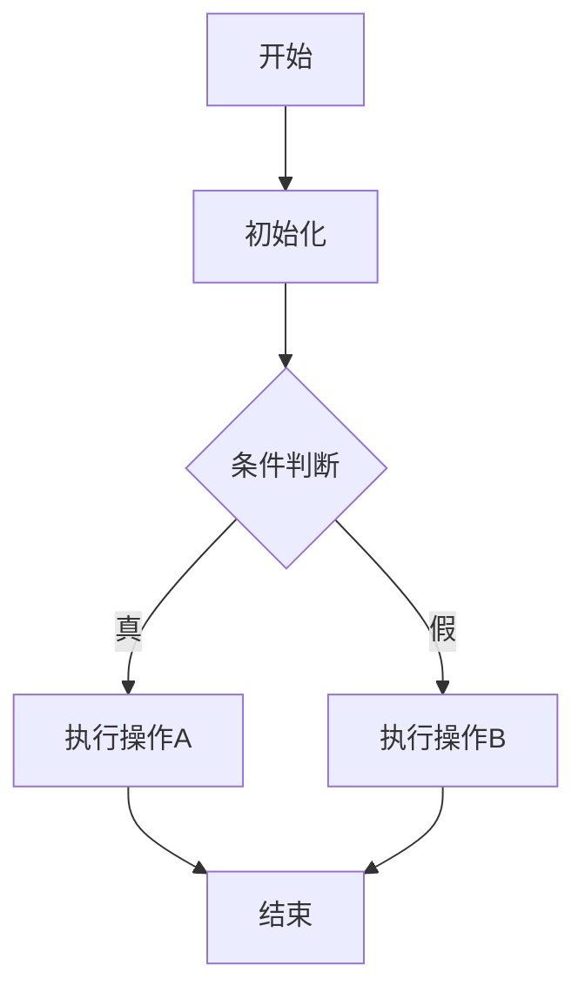

当实现一个完整的类或修改一个类时，必须按照以下步骤编写对应的文档：

## 1. 编写 API 文档

在 `OHB80PortMonitor_V_1_0_0/docs/api/` 目录下创建对应的 markdown 文档，文件名应与类名或模块名保持一致（小写+下划线格式）。

API 文档应包含：
- **模块概述**：简要描述该模块/类的功能和用途
- **类/接口定义**：列出主要的类、接口及其继承关系
- **公共 API**：详细列出所有公共方法、属性，包括：
  - 方法签名
  - 参数说明
  - 返回值说明
  - 异常说明
- **使用示例**：提供完整的使用示例代码，展示如何调用该模块的 API
- **注意事项**：使用该模块时需要注意的事项

## 2. 编写实现文档

在 `OHB80PortMonitor_V_1_0_0/docs/realize/` 目录下创建对应的 markdown 文档，文件名应与类名或模块名保持一致（小写+下划线格式）。

实现文档应包含：
- **设计思路**：说明该模块的设计理念和架构
- **核心流程**：使用 Mermaid 或其他图表工具绘制流程图（严禁使用 ASCII 流程图）
- **关键算法**：说明核心算法的实现逻辑
- **数据结构**：说明使用的主要数据结构
- **依赖关系**：说明该模块依赖的其他模块或类
- **实现细节**：重要的实现细节和技巧

## 3. 流程图要求

- 必须使用 Mermaid 语法或其他标准图表格式
- 流程图应清晰展示模块的执行流程
- 包含主要的决策点和分支
- 标注关键步骤和状态转换

示例 Mermaid 流程图：

## 4. 文档命名规范

- 文件名使用小写字母和下划线，例如：`sh85_self_check_task.md`
- 文件名应与类名对应，便于查找
- 对于复杂模块，可以拆分为多个文档，使用编号区分

## 5. 文档更新时机

- **新建类**：在类实现完成后立即编写 API 和实现文档
- **修改类**：在修改完成后，同步更新对应的文档
- **重构**：重构完成后，更新相关文档以反映新的实现
