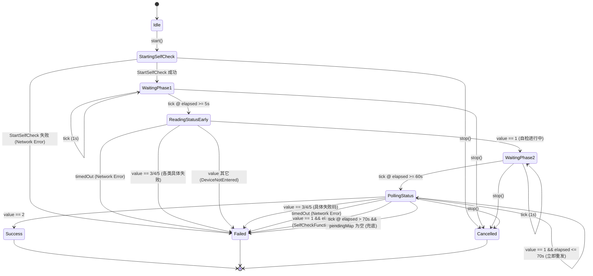
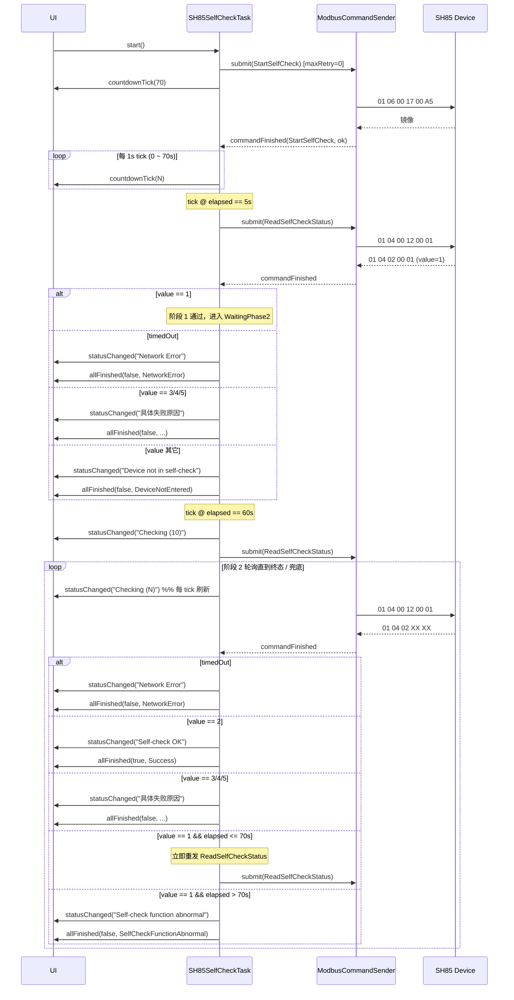

# SH85 自检调度层设计文档

> 模块：`scheduler/tasks/sh85_self_check_task.{h,cpp}`
> 作用：调度 SH85 湿度传感器自检流程，统一管理指令下发、状态轮询、倒计时反馈与最终结果通知。

---

## 1. 业务流程概述

SH85 自检为一个**长时序任务**（~70 秒），由调度层主导，使用以下两条 Modbus 指令：

| 指令 ID | 功能码 | 寄存器 | 用途 | 是否允许超时重发 |
|---|---|---|---|---|
| `StartSelfCheck` | 0x06 | 0x0017 ← 0x00A5 | 启动自检 | ❌ 否（`maxRetryCount = 0`） |
| `ReadSelfCheckStatus` | 0x04 | 0x0012 → 1 reg | 查询自检状态 | ✅ 是（默认重发，依赖底层） |

UI 侧只关心三类输出（信号均携带 `qrcode`，便于多设备路由）：
1. **倒计时秒数**（70 → 0）：用于按钮上的实时计数显示。
2. **状态文本**：`Checking (N)` / `Network Error` / 各种最终结果文案。
3. **最终结果**：`bool success` + `Result` 枚举。

---

## 2. 时序节点

整个任务以一个 **70 秒整体上限** 为兜底，期间分布以下关键节点：

| 时刻 (s) | 行为 |
|---|---|
| `0` | 下发 `StartSelfCheck`（不允许超时重发）；启动 1Hz tick；首发 `countdownTick(70)` |
| `0 ~ 70` | 每 1s 发出 `countdownTick(70 - elapsed)` |
| `5`  | **阶段 1**：下发 `ReadSelfCheckStatus`，预期 `value == 1`（已进入自检）；非 1 立即终止 |
| `60` | **阶段 2 起点**：下发 `ReadSelfCheckStatus`，发出 `statusChanged("Checking (10)")`，**轮询直至拿到终态** |
| `60 ~ 70` | 阶段 2 轮询：每秒刷新 `Checking (N)`；收到 `value == 1` 立即重发 |
| `70` | 整体兜底：若仍处于 `value == 1` → `Self-check function abnormal` |

> **关键设计点**：
> - 阶段 2 不再「只读一次」，改为**轮询读取**直到收到终态值（2/3/4/5）。
> - 70s 兜底仅在「响应仍为 1」或「无未响应指令时已超时」时生效；若 70s 时正在等待响应，等响应回来再判定，避免误杀刚回来的 `value == 2`。

---

## 3. 状态机



---

## 4. 时序图



---

## 5. 自检状态码映射

读取寄存器 `0x0012` 的 16 位值（按大端拼接：`(hi << 8) | lo`）：

| 值 | 含义 | 阶段 1（5s）反馈 | 阶段 2（≥60s）反馈 | 任务结果 |
|---|---|---|---|---|
| 0 | 无报警 / 空闲 | `Device not in self-check` | `Self-check function abnormal` | Failed |
| 1 | 自检进行中（不能进行充气操作） | （通过，进入 WaitingPhase2） | elapsed ≤ 70s：继续轮询；<br>elapsed > 70s：`Self-check function abnormal` | 进行中 / Failed（70s 兜底） |
| 2 | 自检成功 | `Device not in self-check`（不应在阶段 1 出现） | `Self-check OK` | 阶段 1：Failed；阶段 2：Success |
| 3 | 湿度超标失败 | `Humidity exceeded threshold` | `Humidity exceeded threshold` | Failed |
| 4 | 85 传感器通讯故障 | `SH85 sensor comm error` | `SH85 sensor comm error` | Failed |
| 5 | 阈值参数错误（湿度下限阈值 ≤ 0） | `Threshold parameter error` | `Threshold parameter error` | Failed |
| 其它/异常 | — | `Device not in self-check` | `Self-check function abnormal` | Failed |
| 指令超时 | — | `Network Error` | `Network Error` | Failed |

> 阶段 1 即便不是 `value == 1` 也会**根据具体值给出更精确的失败原因**（3/4/5 直接返回对应 Result），不是统一抛 `DeviceNotEntered`。

---

## 6. 与底层重发信号的协作

底层 `ModbusCommandSender` 在指令超时且允许重发时会先发 `commandTimeoutRetry` 信号，再投入重发队列。

| 指令 | maxRetryCount | 调度层处理 |
|---|---|---|
| `StartSelfCheck` | **0**（克隆后强制覆盖） | 一旦超时 = 任务失败（`Network Error`） |
| `ReadSelfCheckStatus`（阶段 1） | 默认（XML 配置） | 不订阅 `commandTimeoutRetry`；最终 `commandFinished(timedOut=true)` 才视为失败 |
| `ReadSelfCheckStatus`（阶段 2 轮询） | 默认 | 同上；UI 状态保持 `Checking (N)` |

> 任务对外暴露的失败时刻**永远是 `commandFinished` 的最终结果**，重发过程对 UI 透明。

---

## 7. 任务接口

### 7.1 类声明（实际代码）

```cpp
// scheduler/tasks/sh85_self_check_task.h
class SH85SelfCheckTask : public SchedulerTask
{
    Q_OBJECT
public:
    enum class Result {
        Success,                    // value == 2
        NetworkError,               // 任意阶段 timedOut
        DeviceNotEntered,           // 阶段 1 value 不属于已知失败码也不为 1
        HumidityExceeded,           // value == 3
        SensorCommError,            // value == 4
        ThresholdParamError,        // value == 5
        SelfCheckFunctionAbnormal,  // 70s 兜底仍为 value == 1，或阶段 2 未知值
        Cancelled                   // 外部 stop()
    };
    Q_ENUM(Result)

    explicit SH85SelfCheckTask(const QString &qrcode, QObject *parent = nullptr);
    void start() override;
    void stop()  override;
    QString taskType() const override { return "SH85SelfCheckTask"; }

    static constexpr int kTotalDurationMs = 70000;
    static constexpr int kPhase1ProbeMs   = 5000;
    static constexpr int kPhase2StartMs   = 60000;
    static constexpr int kCountdownTickMs = 1000;

signals:
    // 整体倒计时（剩余秒数 70 → 0）
    void countdownTick(int remainingSeconds, const QString &qrcode);

    // 状态文本（"Checking (N)" / "Network Error" / 终态文案）
    void statusChanged(const QString &text, const QString &qrcode);

    // 任务结束
    void allFinished(bool success,
                     SH85SelfCheckTask::Result result,
                     const QString &qrcode);
};
```

### 7.2 内部 Phase 与 CmdKind

```cpp
enum class Phase {
    Idle,
    StartingSelfCheck,    // 等 StartSelfCheck 响应
    WaitingPhase1,        // 0 ~ 5s
    ReadingStatusEarly,   // 等阶段 1 响应
    WaitingPhase2,        // 5s ~ 60s
    PollingStatus,        // 60s 起循环读取 / 等响应
    Done
};

// 用于在 onCommandFinished 区分回调归属
enum class CmdKind { StartSelfCheck, ReadStatusEarly, ReadStatusPoll };
```

`m_pendingMap` (`QHash<qint64 uuid, CmdKind>`) 维护已发送但等待响应的指令。

---

## 8. 关键实现要点

1. **`StartSelfCheck` 屏蔽重发**：`pool->clone()` 后立即 `cmd.maxRetryCount = 0`，单次失败立即结束。
2. **倒计时与阶段切换共用 1Hz `QTimer`**：
   - `onTick()` 既向 UI 发 `countdownTick`，又检查阶段切换条件（5s / 60s）。
   - 阶段切换由 `m_phase1Triggered` / `m_phase2Triggered` 标志保证只触发一次。
3. **响应区分用 `m_pendingMap[uuid] → CmdKind`**：阶段 1 和阶段 2 用同一条指令，但 uuid 不同，通过 take 出 CmdKind 走 switch 三分支。
4. **阶段 2 倒计时去重**：`m_lastPhase2Sec` 避免同一秒内多次 emit `Checking (N)`。
5. **70s 兜底两条路径**：
   - 响应处理中：收到 `value == 1` 时检查 `elapsed > 70s`。
   - tick 中：`PollingStatus && elapsed > 70s && m_pendingMap.isEmpty()` → 兜底（仅在没有等待响应时触发，避免误杀）。
6. **`finishWith()` 幂等**：`m_finishedEmitted` 标志防止重复 emit `allFinished`。
7. **stop() 即时终止**：标记 `m_stopped`，调用 `finishWith(false, Cancelled, "Cancelled")`，停掉 tick、断开 connect、清空 pendingMap。
8. **失败优先级**：`NetworkError`（超时）> 状态码具体失败 > 70s 兜底 `SelfCheckFunctionAbnormal`。

---

## 9. 阶段 2 轮询关键伪代码

```cpp
case CmdKind::ReadStatusPoll: {
    if (!ok) {
        finishWith(false, Result::NetworkError, "Network Error");
        return;
    }
    const quint16 v = parseStatusValue(cmd);
    switch (v) {
        case 2: finishWith(true,  Result::Success,             "Self-check OK");                return;
        case 3: finishWith(false, Result::HumidityExceeded,    "Humidity exceeded threshold");  return;
        case 4: finishWith(false, Result::SensorCommError,     "SH85 sensor comm error");       return;
        case 5: finishWith(false, Result::ThresholdParamError, "Threshold parameter error");    return;
        case 1:
            if (m_elapsed.elapsed() > kTotalDurationMs)
                finishWith(false, Result::SelfCheckFunctionAbnormal, "Self-check function abnormal");
            else
                submitReadStatus(CmdKind::ReadStatusPoll);   // 立即重发
            return;
        default:
            finishWith(false, Result::SelfCheckFunctionAbnormal, "Self-check function abnormal");
            return;
    }
}
```

---

## 10. UI 集成示例

```cpp
auto *task = new SH85SelfCheckTask(qrcode);

// 倒计时驱动按钮文案：Checking (70s) → ... → Checking (0s)
connect(task, &SH85SelfCheckTask::countdownTick, this,
    [btn](int sec, const QString&) {
        btn->setText(QString("Checking (%1s)").arg(sec));
    });

// 状态 Label：阶段 2 显示 "Checking (10)" → "Checking (1)"
//            或 "Network Error" / "Self-check OK" / 各类失败文案
connect(task, &SH85SelfCheckTask::statusChanged, this,
    [label](const QString &text, const QString&) {
        label->setText(text);
    });

connect(task, &SH85SelfCheckTask::allFinished, this,
    [btn](bool ok, SH85SelfCheckTask::Result r, const QString &qr) {
        btn->setEnabled(true);
        // 弹窗 / 持久化 ...
    });

scheduler.submit(task);
```

---

## 11. 验收清单

- [ ] `StartSelfCheck` 超时（断网）→ UI 收到 `Network Error`，任务结束，**不重发**。
- [ ] 5s 时返回 `value=1` → 阶段 1 通过，倒计时正常。
- [ ] 5s 时返回 `value=0` → UI 收到 `Device not in self-check`，任务结束。
- [ ] 5s 时返回 `value=3/4/5` → UI 立即收到对应失败文案（精确原因，不等 60s）。
- [ ] 60s 时首发返回 `value=2` → UI 显示 `Self-check OK`，任务成功。
- [ ] 60s 时返回 `value=3/4/5` → UI 显示对应错误文本。
- [ ] 60s 时返回 `value=1`，68s 时返回 `value=2` → UI 显示 `Self-check OK`（轮询通过）。
- [ ] 60s/65s/70s 全部返回 `value=1` → UI 显示 `Self-check function abnormal`。
- [ ] 阶段 2 期间任意一次指令超时 → UI 显示 `Network Error`。
- [ ] 70s 时刻仍在等待响应，72s 收到 `value=2` → UI 显示 `Self-check OK`（不被兜底误杀）。
- [ ] 阶段 2 期间 UI 状态文本每秒刷新：`Checking (10)` → `Checking (9)` → ... → `Checking (1)`。
- [ ] 任意时刻 `stop()` → 任务立即终止，UI 收到 `statusChanged("Cancelled")` 与 `allFinished(false, Cancelled)`。

---

## 12. 文件清单

| 文件 | 说明 |
|---|---|
| `scheduler/tasks/sh85_self_check_task.h` | 类声明（`Result` / `Phase` / `CmdKind` 枚举，常量，信号） |
| `scheduler/tasks/sh85_self_check_task.cpp` | 实现 |
| `scheduler/scheduler.pri` | 已加入 HEADERS / SOURCES |
| `bin/config/ModbusTcpMasterConfig.xml` | `StartSelfCheck`（FC=06, 0x0017←0x00A5）<br>`ReadSelfCheckStatus`（FC=04, 0x0012, 1 reg） |
