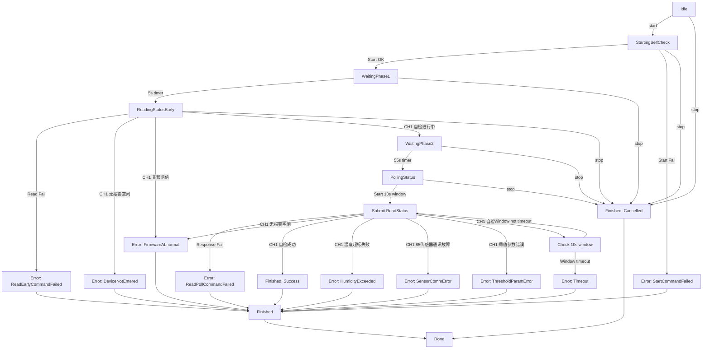
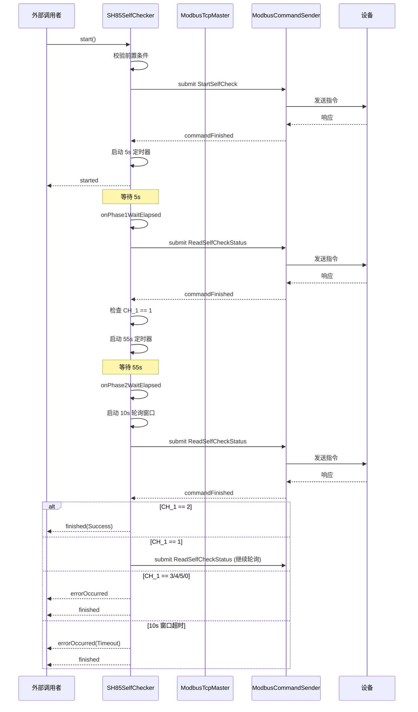

# SH85SelfChecker 实现文档

## 设计思路

### 设计目标

将原本仅存在于 Scheduler 层（`SH85SelfCheckTask`）中的 SH85 自检功能下沉到 data 层，作为 `ModbusTcpMaster` 的子控件存在。主要目标：

1. **支持多设备并行自检**：每个 master 自带一个自检器实例，互不干扰
2. **降低耦合度**：自检逻辑不依赖 SchedulerTask，可被任意线程调用
3. **统一架构**：与 connector / sender / periodicSender 等子控件保持一致的获取方式
4. **线程安全**：通过 Qt 信号槽的 QueuedConnection 保证跨线程安全

### 架构定位

```
ModbusTcpMaster
├── connector (ModbusConnecter)
├── sender (ModbusCommandSender)
├── receiver (ModbusCommandReceiver)
├── initialIssuer (InitialCommandIssuer)
├── periodicSender (PeriodicCommandSender)
├── firmwareUpgrader (FirmwareUpgrader)
└── selfChecker (SH85SelfChecker)  ← 新增
```

### 与 SH85SelfCheckTask 的关系

- `SH85SelfCheckTask`：Scheduler 层调度任务，管理单设备自检，依赖 ModbusTcpMasterManager
- `SH85SelfChecker`：Data 层子控件，每个 master 自带，不依赖 Scheduler 层
- 两者可共存，后续可选择切换到 `SH85SelfChecker` 替代或保持双轨

## 核心流程

### 指令格式说明

#### StartSelfCheck - 启动 SH85 自检流程

- **功能码**：06（写单个保持寄存器）
- **寄存器地址**：0x0017
- **写入值**：0x00A5（启动自检）
- **请求帧格式**：`01 06 00 17 00 A5 CRC`
- **响应帧格式**：`01 06 00 17 00 A5 CRC`（镜像返回）
- **备注**：返回值与写入值相同，用于确认指令已正确接收

#### ReadSelfCheckStatus - 自检反馈状态查询

- **功能码**：04（读输入寄存器）
- **寄存器地址**：0x0012
- **读取数量**：1 个寄存器（2 字节）
- **请求帧格式**：`01 04 00 12 00 01 CRC`
- **响应帧格式**：`01 04 02 XX XX CRC`
- **CH_1 状态值解析**：
  - `0x0000`：无报警/空闲
  - `0x0001`：自检进行中（不能进行充气操作）
  - `0x0002`：自检成功
  - `0x0003`：湿度超标失败
  - `0x0004`：85 传感器通讯故障
  - `0x0005`：阈值参数错误（湿度下限阈值 <= 0）
- **数值计算**：`Value = (256 * hi_byte + lo_byte)`

### 自检过程详细描述

完整的 SH85 自检流程共约 70 秒，分为三个主要阶段：

#### 阶段 0：下发自检启动指令

1. 调用发送器，下发 `StartSelfCheck` 指令（`maxRetryCount = 0`，不允许超时重发）
2. 若指令下发失败，发出 `errorOccurred(StartCommandFailed)` 信号并结束流程
3. 若指令下发成功，进入阶段 1 等待

#### 阶段 1：验证设备进入自检状态（5s）

1. 等待 5 秒后，下发 `ReadSelfCheckStatus` 指令
2. 若指令下发失败，发出 `errorOccurred(ReadEarlyCommandFailed)` 信号并结束流程
3. 若指令下发成功，解析响应中的 CH_1 状态值：
   - `CH_1 = 0`（无报警/空闲）：设备未进入自检功能，发出 `errorOccurred(DeviceNotEntered)` 信号并结束流程
   - `CH_1 = 1`（自检进行中）：设备已正确进入自检状态，进入阶段 2 等待
   - `CH_1 != 0 && CH_1 != 1`：底层固件异常，发出 `errorOccurred(FirmwareAbnormal)` 信号并结束流程

#### 阶段 2：轮询自检结果（55s + 10s 轮询窗口）

1. 等待 55 秒后，进入 10 秒轮询窗口
2. 循环下发 `ReadSelfCheckStatus` 指令，每次响应后根据 CH_1 状态值判断：
   - **指令下发失败**：发出 `errorOccurred(ReadPollCommandFailed)` 信号并结束流程
   - **CH_1 = 0**（无报警/空闲）：自检中却返回空闲状态，底层固件异常，发出 `errorOccurred(FirmwareAbnormal)` 信号并结束流程
   - **CH_1 = 1**（自检进行中）：仍在自检中，若 10 秒窗口未超时则继续轮询，若窗口超时则发出 `errorOccurred(Timeout)` 信号并结束流程
   - **CH_1 = 2**（自检成功）：自检完成，发出 `finished(success=true, Success)` 信号并结束流程
   - **CH_1 = 3**（湿度超标失败）：发出 `errorOccurred(HumidityExceeded)` 信号并结束流程
   - **CH_1 = 4**（85 传感器通讯故障）：发出 `errorOccurred(SensorCommError)` 信号并结束流程
   - **CH_1 = 5**（阈值参数错误）：发出 `errorOccurred(ThresholdParamError)` 信号并结束流程
   - **CH_1 为其他值**：未知状态，发出 `errorOccurred(FirmwareAbnormal)` 信号并结束流程

3. 若 10 秒轮询窗口结束时仍未收到终态值（CH_1 != 2 且 CH_1 != 3/4/5），发出 `errorOccurred(Timeout)` 信号并结束流程

#### 主动取消

在任何阶段，若外部调用 `stop()`，则发出 `finished(success=false, Cancelled)` 信号并结束流程（不发 `errorOccurred` 信号）。

### 状态机流程图



### 时序图



## 关键算法

### 指令下发算法

```cpp
bool SH85SelfChecker::submitStartSelfCheck()
{
    // 1. 从全局指令池克隆模板
    CommandPool* pool = ModbusTcpMasterManager::instance().commandPool();
    ModbusCommand cmd = pool->clone(kCmdStart);
    
    // 2. 设置关键参数
    cmd.module = CommandModule::BusinessCommandIssuer;
    cmd.maxRetryCount = 0;  // 不允许超时重发
    
    // 3. 记录 uuid 用于响应过滤
    m_pendingUuid = cmd.uuid;
    
    // 4. 跨线程提交（QueuedConnection）
    QMetaObject::invokeMethod(sender, [sender, cmd]() {
        sender->submit(cmd);
    }, Qt::QueuedConnection);
    
    return true;
}
```

### 响应过滤算法

```cpp
void SH85SelfChecker::onCommandFinished(ModbusCommand cmd, const QString& masterId)
{
    // 1. 基本过滤
    if (!isRunning()) return;
    if (masterId != m_master->ID) return;
    if (cmd.uuid != m_pendingUuid) return;
    
    // 2. 清除待响应标记
    m_pendingUuid = 0;
    
    // 3. 根据当前状态处理
    switch (m_state) {
        case State::StartingSelfCheck:
            // 处理 StartSelfCheck 响应
            break;
        case State::ReadingStatusEarly:
            // 处理阶段 1 ReadSelfCheckStatus 响应
            break;
        case State::PollingStatus:
            // 处理阶段 2 轮询响应
            break;
    }
}
```

### 状态值解析算法

```cpp
quint16 SH85SelfChecker::parseStatusValue(const ModbusCommand& cmd) const
{
    const QByteArray& v = cmd.response.registerValue;
    if (v.size() < 2) return 0xFFFF;  // 数据不足
    
    // 大端序解析 2 字节
    return (static_cast<quint16>(static_cast<quint8>(v[0])) << 8)
         |  static_cast<quint16>(static_cast<quint8>(v[1]));
}
```

## 数据结构

### 成员变量

```cpp
ModbusTcpMaster* m_master = nullptr;       // 所属 master
State            m_state  = State::Idle;    // 当前状态
qint64           m_pendingUuid = 0;        // 当前等待响应的指令 uuid

QTimer*          m_phase1Timer = nullptr;     // 5s 定时器
QTimer*          m_phase2Timer = nullptr;     // 55s 定时器
QTimer*          m_pollWindowTimer = nullptr; // 10s 轮询窗口

QMetaObject::Connection m_senderConn;        // sender::commandFinished 连接句柄

bool             m_finished = false;        // 防止重复 emit finished
```

### 状态常量

```cpp
static constexpr int kPhase1WaitMs = 5000;    // 阶段 1 等待时长
static constexpr int kPhase2WaitMs = 55000;   // 阶段 2 等待时长
static constexpr int kPollWindowMs = 10000;   // 轮询窗口时长
static constexpr int kPollIntervalMs = 1000; // 轮询间隔
```

## 依赖关系

### 依赖模块

- `ModbusTcpMaster`：所属 master，提供 sender 和 ID
- `ModbusCommandSender`：指令发送器，用于下发 Modbus 指令
- `ModbusTcpMasterManager`：全局管理器，提供 CommandPool
- `CommandPool`：指令池，用于克隆指令模板
- `LoggerManager`：日志管理器，用于记录操作日志

### 被依赖模块

- `ModbusTcpMaster`：创建并持有 SH85SelfChecker 实例
- 业务层 / UI 层：通过 `master->selfChecker()` 获取实例并调用

## 实现细节

### 线程安全保证

1. **信号槽连接**：使用 `Qt::QueuedConnection` 连接 sender 的 `commandFinished` 信号，确保跨线程安全
2. **指令提交**：使用 `QMetaObject::invokeMethod` 跨线程提交指令
3. **状态机保护**：`start()` 方法检查当前状态，避免重复启动
4. **防重入保护**：`m_finished` 标志防止重复 emit finished 信号

### 定时器管理

- 三个单次触发定时器分别实现 5s / 55s / 10s 时序
- `cleanup()` 统一停止所有定时器
- 定时器以 `this` 为父对象，自动跟随对象销毁

### 资源清理

```cpp
void SH85SelfChecker::cleanup()
{
    // 1. 停止所有定时器
    if (m_phase1Timer)     m_phase1Timer->stop();
    if (m_phase2Timer)     m_phase2Timer->stop();
    if (m_pollWindowTimer) m_pollWindowTimer->stop();
    
    // 2. 断开 sender 信号槽
    if (m_senderConn) {
        QObject::disconnect(m_senderConn);
        m_senderConn = QMetaObject::Connection();
    }
    
    // 3. 清除待响应标记
    m_pendingUuid = 0;
}
```

### 错误处理策略

1. **前置条件失败**：`start()` 直接返回 false，不发任何信号
2. **指令下发失败**：发出 `errorOccurred` 信号，然后发出 `finished` 信号
3. **设备响应异常**：根据 CH_1 值分类错误，发出对应的 `errorOccurred` 信号
4. **超时处理**：10s 轮询窗口超时后发出 `errorOccurred(Timeout)` 信号
5. **取消处理**：`stop()` 仅发出 `finished(Cancelled)` 信号，不发 `errorOccurred`

### 日志记录

所有关键操作都会写入对应 master 的日志文件：

- 启动自检：`[data][SH85SelfChecker] 自检流程已启动 masterId=xxx`
- 状态变更：`[data][SH85SelfChecker] 状态切换: xxx -> xxx masterId=xxx`
- 错误发生：`[data][SH85SelfChecker] errorOccurred: xxx (xxx) masterId=xxx`
- 流程结束：`[data][SH85SelfChecker] finished success=xxx result=xxx msg='xxx' masterId=xxx`

日志路径通过 `AppLogger::ModbusMasterLoggerPath(masterId)` 获取。

### 与 SH85SelfCheckTask 的对比

| 特性 | SH85SelfCheckTask | SH85SelfChecker |
|------|-------------------|-----------------|
| 所在层级 | Scheduler 层 | Data 层 |
| 实例归属 | 全局单例任务池 | 每个 master 一个实例 |
| 获取方式 | `SharedData::getSH85SelfCheckTask()` | `master->selfChecker()` |
| 并发支持 | 需要任务队列支持 | 天然支持（每设备独立实例） |
| 依赖关系 | 依赖 ModbusTcpMasterManager | 仅依赖所属 master |
| 信号机制 | 倒计时 tick + 状态变更 | 启动 + 状态变更 + 错误 + 结束 |
| 取消方式 | `stop()` | `stop()` |
| 适用场景 | 统一调度管理 | 多设备并行自检 |

### 扩展性考虑

1. **时序参数可配置**：当前时序参数为静态常量，后续可改为可配置成员变量
2. **错误恢复策略**：当前失败即结束，后续可增加自动重试机制
3. **状态查询增强**：当前仅提供 `currentState()`，后续可增加历史状态查询
4. **进度通知**：当前无进度信号，后续可增加轮询进度百分比信号
