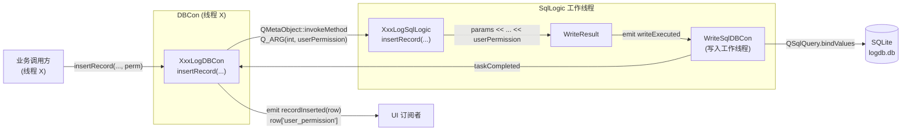
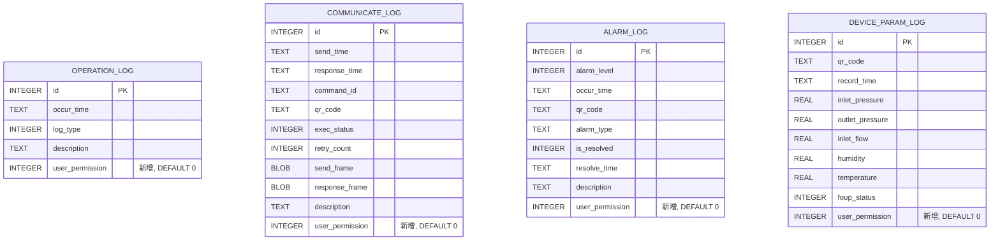
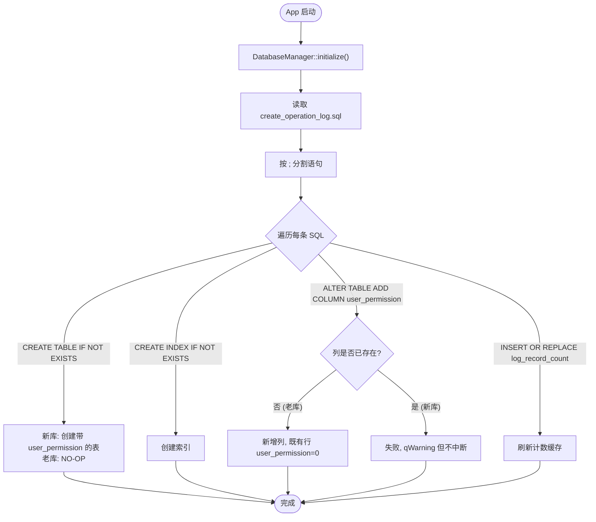

# 日志数据库 user_permission 字段 — 实现文档

## 设计思路

需求：在 4 张日志表的每一行都附带"操作来源的用户权限级别"，便于审计与按权限过滤。

设计要点：

1. **字段位置**：放在每张表的最后一列（`description` 之后或 `foup_status` 之后），避免改动既有列顺序。
2. **类型**：`INTEGER NOT NULL DEFAULT 0`，0 = `UserPermission::Guest`，与 `UserManager` 保持一致。
3. **默认值兼容**：在 C++ 接口层把 `int userPermission = 0` 作为**末位带默认值**参数，旧代码零改动。
4. **老库迁移**：通过 `ALTER TABLE ... ADD COLUMN ... DEFAULT 0` 实现幂等迁移，新库该语句会因列已存在而失败，但 `databasemanager.cpp::createDatabaseFromSqlFile` 对每条 SQL 失败只打 `qWarning` 不中断，因此不影响启动。
5. **跨线程传参**：所有 `*SqlLogic::insertRecord` 也加同名参数，DBCon 通过 `QMetaObject::invokeMethod` + `Q_ARG(int, userPermission)` 跨线程派发到 worker thread。

## 数据流

## 表结构变更

## 启动迁移流程

## 关键修改清单

### SQL 文件（`bin/x32/databases/` 与 `bin/x64/databases/`）

| 文件 | 修改内容 |
| --- | --- |
| `create_operation_log.sql` | 4 个 `CREATE TABLE` 末尾各加 `user_permission INTEGER NOT NULL DEFAULT 0` 列；文件末尾追加 4 条 `ALTER TABLE ... ADD COLUMN ... DEFAULT 0` 迁移语句 |
| `operation_log_queries.sql` | `insert_record` SQL 列出加上 `user_permission`，VALUES 多一个 `?` |
| `alarm_log_queries.sql` | 同上 |
| `communicate_log_queries.sql` | 同上 |
| `device_param_log_queries.sql` | 同上 |

### C++ 文件（每个模块 4 个文件，共 16 处修改）

| 模块 | 文件 | 修改 |
| --- | --- | --- |
| operation | `operationlogdb/operationlogdbcon.{h,cpp}` | `insertRecord` 加 `int userPermission = 0`；`onWriteTaskCompleted` row 增加字段 |
| operation | `operationlogdb/operationlogsqllogic.{h,cpp}` | `insertRecord` 加参数；`result.params` 末尾追加 `userPermission` |
| alarm | `alarmlogdb/alarmlogdbcon.{h,cpp}` | 同上 |
| alarm | `alarmlogdb/alarmlogsqllogic.{h,cpp}` | 同上 |
| communicate | `communicatelogdb/communicatelogdbcon.{h,cpp}` | 同上 |
| communicate | `communicatelogdb/communicatelogsqllogic.{h,cpp}` | 同上 |
| deviceparam | `deviceparamlogdb/deviceparamlogdbcon.{h,cpp}` | 同上（`DeviceParamLogDBCon` 不发 `recordInserted` 信号，无需修改信号 row） |
| deviceparam | `deviceparamlogdb/deviceparamlogsqllogic.{h,cpp}` | 同上 |

## 关键实现细节

### 1. params 顺序必须与 SQL 列顺序严格对齐

`SqlLogic::insertRecord` 把所有参数按 SQL `INSERT INTO ... (col1, col2, ...) VALUES (?, ?, ...)` 的列顺序压入 `result.params`，由 `WriteSqlDBCon` 在写线程中按顺序 `addBindValue`。`user_permission` 永远是最后一个，对应 SQL 中也是最后一列。

### 2. `onWriteTaskCompleted` 同步派发新字段

`AlarmLog / OperationLog / CommunicateLog` 三个 DBCon 在收到写入完成回调后，会构造 `QVariantMap row` 通过 `recordInserted` 信号广播给 UI。新增字段 `row["user_permission"] = result.params.at(N)` 与 SQL params 顺序保持一致。`DeviceParamLogDBCon` 没有该信号，无须修改。

### 3. 跨线程默认值

`Q_INVOKABLE` 槽函数通过 `QMetaObject::invokeMethod` 调用时**不会**应用 C++ 默认参数（因为是按字符串匹配函数签名），所以 SqlLogic 的 `insertRecord` 也必须在头文件里把 `int userPermission = 0` 作为**最后一个参数的默认值**。这样：

- DBCon 调用 SqlLogic 时一定显式传值（DBCon 对应 `Q_ARG(int, userPermission)`）。
- SqlLogic 头文件的默认值仅是给单元测试 / 直接调用兜底，不影响 invokeMethod 路径。

### 4. 老库迁移的幂等性

`ALTER TABLE ... ADD COLUMN user_permission INTEGER NOT NULL DEFAULT 0` 在 SQLite 中：

- 老库（无该列）：成功，既有行的 `user_permission` 自动填 `DEFAULT 0`。
- 新库（CREATE TABLE 已含此列）：报错 `duplicate column name`，但 `databasemanager.cpp` 中只 `qWarning()`，整体启动不受影响。

因此**不需要**额外的版本号判断，SQL 自身即幂等。

## 依赖关系

- `data/usermanager/usermanager.h` 提供 `UserPermission` 枚举与 `UserManager::currentPermission()`。
- `data/logdatabases/databasemanager.cpp::createDatabaseFromSqlFile` 提供 SQL 多语句执行与失败容忍。
- `data/logdatabases/writesqldb/writesqldbcon.{h,cpp}` 不需修改（参数是 `QVariantList`，已天然支持新增列）。
