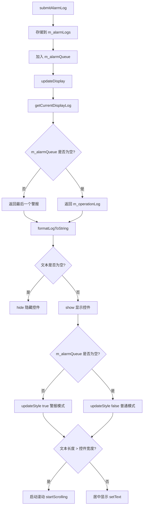
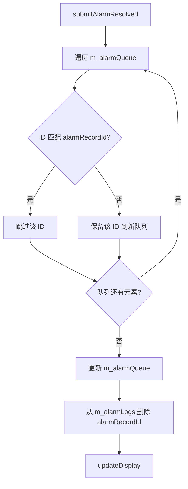
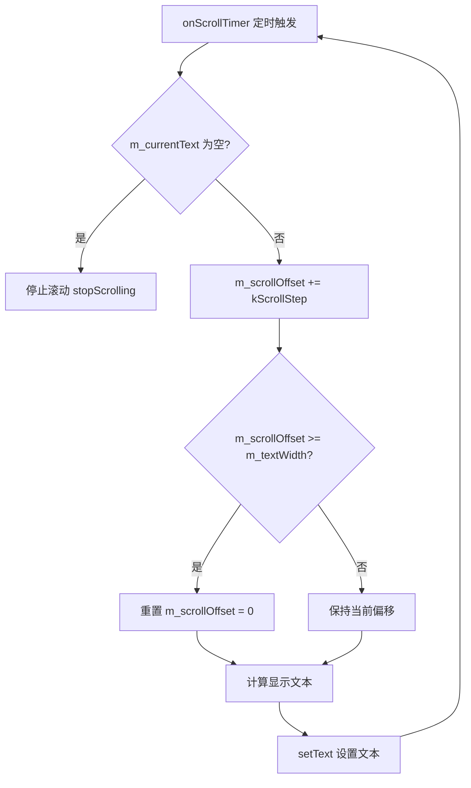
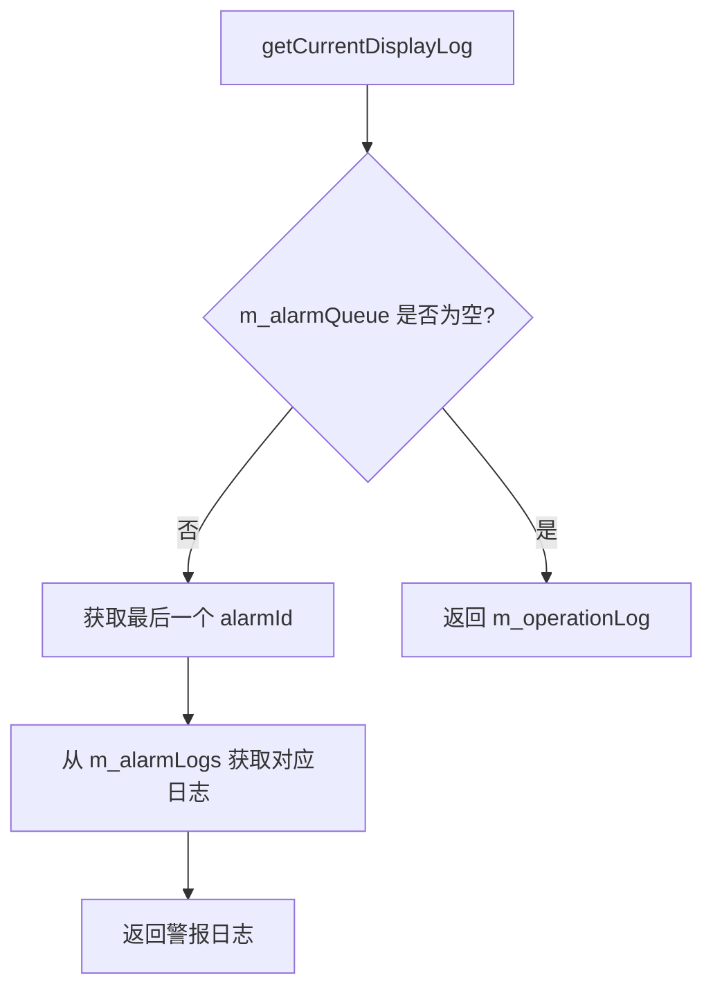

# ScrollingTipLabel 实现文档

## 设计思路

ScrollingTipLabel 采用队列 + 映射的数据结构来管理警报日志和操作日志，实现警报优先显示机制。核心设计理念如下：

1. **警报优先**：使用队列 `m_alarmQueue` 管理警报 ID，队列不空时优先显示最后一个警报
2. **消息消除**：通过警报 ID 从队列和映射表中删除对应记录，通过替换操作日志实现消息更新
3. **UI 线程使用**：该控件为 UI 控件，必须在 UI 线程中使用。调度层通过信号传递日志，调度层不需要知道该模块的存在
4. **滚动显示**：当文本长度超过控件宽度时，使用定时器实现平滑滚动效果
5. **样式切换**：根据当前显示的消息类型（警报/普通）自动切换样式，警报模式使用红色背景更显眼
6. **自动隐藏**：当没有任何可显示的消息时，控件自动隐藏；有新消息时自动显示

---

## 核心流程

### 提交警报日志流程



### 提交警报已解决流程



### 滚动显示流程



### 获取当前待显示日志流程



---

## 关键算法

### 滚动算法

滚动算法使用定时器 + 偏移量的方式实现：

```cpp
void ScrollingTipLabel::onScrollTimer()
{
    if (m_currentText.isEmpty()) {
        stopScrolling();
        return;
    }

    QFontMetrics fm(font());
    int labelWidth = width();

    // 每次滚动增加偏移量
    m_scrollOffset += kScrollStep;

    // 检查是否滚动完毕
    if (m_scrollOffset >= m_textWidth) {
        // 整个字符串滚动完毕，从头开始
        m_scrollOffset = 0;
    }

    // 计算显示文本（使用省略号表示滚动效果）
    QString displayText = m_currentText;
    if (m_textWidth > labelWidth) {
        int charsToSkip = m_scrollOffset / 8; // 粗略估计字符宽度
        displayText = displayText.mid(charsToSkip);
        displayText += " ... " + m_currentText.left(charsToSkip);
    }

    setText(displayText);
}
```

**算法特点：**
- 每次滚动固定像素（`kScrollStep = 2`）
- 滚动到末尾后自动循环
- 使用省略号表示滚动效果

---

## 数据结构

### 主要数据结构

| 成员变量 | 类型 | 说明 |
|---|---|---|
| `m_alarmQueue` | `QQueue<int>` | 警报队列，存放 AlarmLogDBCon 的主键 ID，先进先出 |
| `m_operationLog` | `QStringList` | 存放一条 OperationLogDBCon 记录 |
| `m_alarmLogs` | `QHash<int, QStringList>` | alarmRecordId → operationLog 映射，用于快速查找警报日志 |
| `m_scrollTimer` | `QTimer*` | 滚动定时器，间隔 100ms |
| `m_scrollOffset` | `int` | 当前滚动偏移量（像素） |
| `m_currentText` | `QString` | 当前显示的文本 |
| `m_textWidth` | `int` | 当前文本的像素宽度 |
| `m_isAlarmMode` | `bool` | 当前是否显示警报（用于样式切换） |

### 数据流

```
外部调用
    ↓
submitAlarmLog / submitAlarmResolved / submitOperationLog
    ↓
修改 m_alarmQueue / m_operationLog / m_alarmLogs
    ↓
updateDisplay
    ↓
getCurrentDisplayLog
    ↓
formatLogToString
    ↓
setText / startScrolling
```

---

## 依赖关系

### 外部依赖

| 依赖项 | 用途 |
|---|---|
| `QLabel` | 基类，提供文本显示功能 |
| `QTimer` | 实现滚动定时器 |
| `QStringList` | 存储日志记录 |
| `QQueue<int>` | 管理警报队列 |
| `QHash<int, QStringList>` | 管理警报日志映射 |

### 内部依赖

无内部依赖，该类为独立控件。

---

## 实现细节

### 1. 样式切换机制

控件根据当前显示的消息类型自动切换样式：

```cpp
void ScrollingTipLabel::updateStyle(bool isAlarm)
{
    if (isAlarm) {
        // 警报模式样式：红色背景，更显眼
        setStyleSheet(
            "QLabel {"
            "  background-color: #fff5f5;"
            "  border: 1px solid #ff6b6b;"
            "  border-radius: 4px;"
            "  padding: 6px 10px;"
            "  color: #c92a2a;"
            "  font-size: 13px;"
            "  font-weight: 500;"
            "}"
        );
    } else {
        // 普通模式样式：浅色背景，简洁
        setStyleSheet(
            "QLabel {"
            "  background-color: #f8f9fa;"
            "  border: 1px solid #dee2e6;"
            "  border-radius: 4px;"
            "  padding: 6px 10px;"
            "  color: #495057;"
            "  font-size: 13px;"
            "}"
        );
    }
}
```

**样式说明：**
- 警报模式：红色背景（#fff5f5）、红色边框（#ff6b6b）、红色文字（#c92a2a）、加粗字体
- 普通模式：浅灰色背景（#f8f9fa）、灰色边框（#dee2e6）、深灰色文字（#495057）

### 2. 自动隐藏机制

当没有任何可显示的消息时，控件自动隐藏；有新消息时自动显示：

```cpp
void ScrollingTipLabel::updateDisplay()
{
    QStringList log = getCurrentDisplayLog();
    QString text = formatLogToString(log);

    if (text.isEmpty()) {
        setText("");
        stopScrolling();
        updateStyle(false);
        hide();  // 没有消息时隐藏控件
        return;
    }

    show();  // 有消息时显示控件
    // ...
}
```

### 3. 消息消除机制

**警报已解决：**
```cpp
void ScrollingTipLabel::submitAlarmResolved(int alarmRecordId)
{
    // 从队列中移除对应 ID（需要重建队列）
    QQueue<int> newQueue;
    while (!m_alarmQueue.isEmpty()) {
        int id = m_alarmQueue.dequeue();
        if (id != alarmRecordId) {
            newQueue.enqueue(id);
        }
    }
    m_alarmQueue = newQueue;

    // 从映射中删除
    m_alarmLogs.remove(alarmRecordId);

    updateDisplay();
}
```

**操作日志替换：**
```cpp
void ScrollingTipLabel::submitOperationLog(const QStringList& operationLog)
{
    // 直接替换当前记录
    m_operationLog = operationLog;

    updateDisplay();
}
```

### 3. 滚动显示判断

```cpp
void ScrollingTipLabel::updateDisplay()
{
    QStringList log = getCurrentDisplayLog();
    QString text = formatLogToString(log);

    if (text.isEmpty()) {
        setText("");
        stopScrolling();
        return;
    }

    show();  // 有消息时显示控件

    // 判断是否为警报模式
    bool isAlarm = !m_alarmQueue.isEmpty();
    m_isAlarmMode = isAlarm;

    // 更新样式
    updateStyle(isAlarm);

    QFontMetrics fm(font());
    int labelWidth = width();
    m_textWidth = fm.horizontalAdvance(text);

    // 字符串长度大于 label 显示范围，滚动显示
    if (m_textWidth > labelWidth) {
        m_currentText = text;
        m_scrollOffset = 0;
        setText(text);
        startScrolling();
    }
    // 字符串长度小于等于 label 显示范围，居中显示
    else {
        setAlignment(Qt::AlignCenter);
        setText(text);
        stopScrolling();
    }
}
```

### 4. 日志格式化

```cpp
QString ScrollingTipLabel::formatLogToString(const QStringList& log)
{
    if (log.isEmpty()) {
        return "";
    }

    // 假设 QStringList 格式为: [时间, 日志类型, 描述]
    if (log.size() >= 3) {
        return QString("[%1] %2: %3").arg(log[0], log[1], log[2]);
    } else if (log.size() == 1) {
        return log[0];
    }

    return log.join(" ");
}
```

**注意：** 如实际日志格式不同，需调整此方法。

---

## 文件位置

| 文件 | 路径 |
|---|---|
| 头文件 | `OHB80PortMonitor_V_1_0_0/ui/customwidget/scrollingtiplabel/scrollingtiplabel.h` |
| 实现文件 | `OHB80PortMonitor_V_1_0_0/ui/customwidget/scrollingtiplabel/scrollingtiplabel.cpp` |
| 模块文件 | `OHB80PortMonitor_V_1_0_0/ui/customwidget/scrollingtiplabel/scrollingtiplabel.pri` |
| API 文档 | `OHB80PortMonitor_V_1_0_0/docs/api/scrollingtiplabel.md` |
| 实现文档 | `OHB80PortMonitor_V_1_0_0/docs/realize/scrollingtiplabel.md` |
