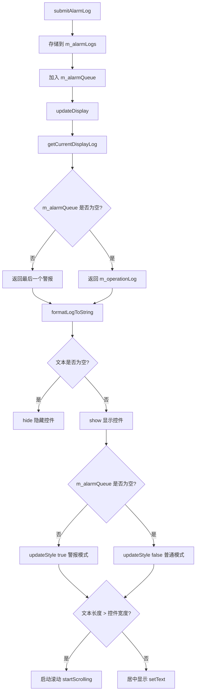
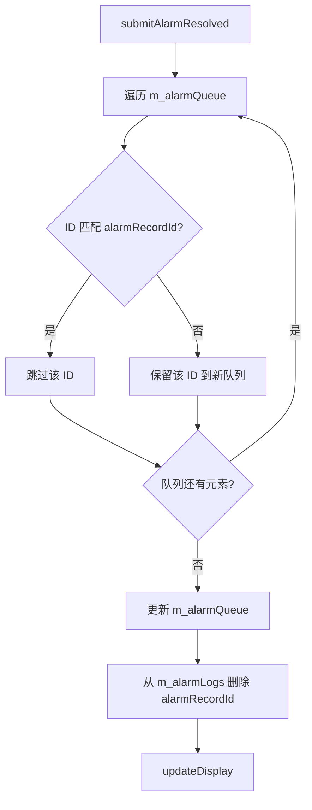
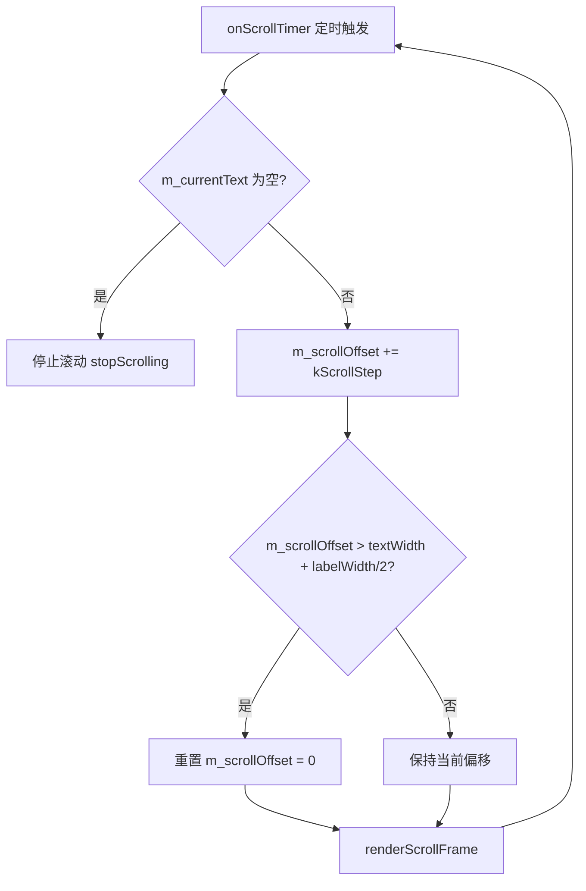
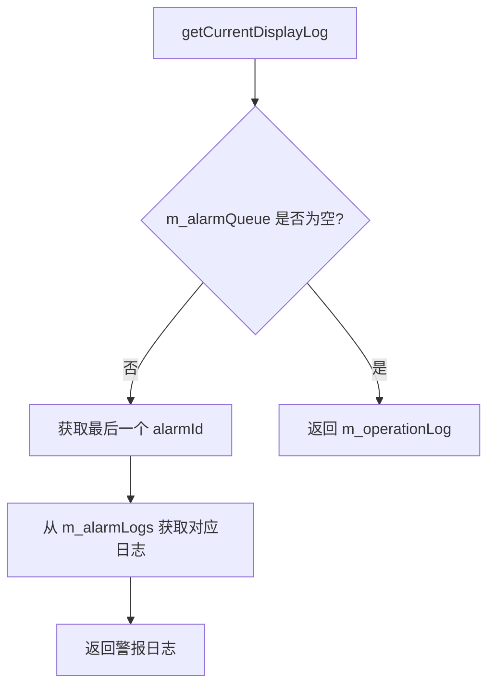

# ScrollingTipLabel 实现文档

## 设计思路

ScrollingTipLabel 采用队列 + 映射的数据结构来管理警报日志和操作日志，实现警报优先显示机制。核心设计理念如下：

1. **警报优先**：使用队列 `m_alarmQueue` 管理警报 ID，队列不空时优先显示最后一个警报
2. **消息消除**：通过警报 ID 从队列和映射表中删除对应记录，通过替换操作日志实现消息更新
3. **UI 线程使用**：该控件为 UI 控件，必须在 UI 线程中使用。调度层通过信号传递日志，调度层不需要知道该模块的存在
4. **滚动显示**：当文本长度超过控件宽度时，使用定时器实现平滑滚动效果
5. **样式切换**：根据当前显示的消息类型（警报/普通）自动切换样式，警报模式使用红色背景更显眼
6. **自动隐藏**：当没有任何可显示的消息时，控件自动隐藏；有新消息时自动显示

---

## 核心流程

### 提交警报日志流程



### 提交警报已解决流程



### 滚动显示流程



**说明：**
- 使用 QPainter 绘制两个文本副本实现无缝循环
- 第一个副本位置：xPos = -m_scrollOffset（从左边缘开始向左滚动）
- 第二个副本位置：xPos + m_textWidth + labelWidth/2（紧跟在第一个副本之后）
- 当 offset 达到 textWidth + labelWidth/2 时，第二个副本正好到达第一个副本的初始位置，无缝循环

### 获取当前待显示日志流程



---

## 关键算法

### 滚动算法

滚动算法使用 QPainter + 双副本无缝循环实现：

```cpp
void ScrollingTipLabel::renderScrollFrame()
{
    QFontMetrics fm(font());
    int labelWidth = width();

    // 使用 QPainter 实现像素级精确滚动
    QPixmap pixmap(labelWidth, height());
    pixmap.fill(Qt::transparent);

    QPainter painter(&pixmap);
    painter.setFont(font());
    painter.setPen(palette().color(QPalette::WindowText));

    // 计算文本绘制位置（从左向右方向向左滚动）
    // offset=0: 文本左边缘对齐标签左边缘（显示 [12345...]）
    // offset=textWidth: 文本右边缘到达标签左边缘（文本完全滚出左侧）
    // offset=textWidth-labelWidth/2: 文本尾部字符到达标签中间
    int xPos = -m_scrollOffset;

    // 计算垂直居中位置
    int yPos = (height() + fm.ascent() - fm.descent()) / 2;

    // 绘制文本（当前副本）
    painter.drawText(xPos, yPos, m_currentText);

    // 绘制文本（下一个副本，紧跟在当前副本之后，实现无缝循环）
    // 两个副本之间的间距为 labelWidth/2，确保尾部到达中间时头部刚好从后端出现
    int nextXPos = xPos + m_textWidth + labelWidth / 2;
    painter.drawText(nextXPos, yPos, m_currentText);

    painter.end();

    setPixmap(pixmap);
}
```

**算法特点：**
- 使用 QPainter 实现像素级精确滚动（`kScrollStep = 2` 像素/帧）
- 绘制两个文本副本实现无缝循环
- 第一个副本从左边缘开始向左滚动（xPos = -m_scrollOffset）
- 第二个副本位置 = 第一个副本位置 + 文本宽度 + 标签宽度/2
- 当 offset > textWidth + labelWidth/2 时重置为 0，实现无缝循环
- 初始帧立即渲染，避免先显示静态文本再跳到滚动状态
- 文本垂直居中显示

---

## 数据结构

### 主要数据结构

| 成员变量 | 类型 | 说明 |
|---|---|---|
| `m_alarmQueue` | `QQueue<QString>` | 警报队列，存放复合 key "qrCode|alarmType"，先进先出 |
| `m_operationLog` | `OperationRecord` | 存放一条 OperationLogDBCon 记录 |
| `m_alarmLogs` | `QHash<QString, AlarmRecord>` | 复合 key → AlarmRecord 映射，用于快速查找警报日志 |
| `m_scrollTimer` | `QTimer*` | 滚动定时器，间隔 100ms |
| `m_scrollOffset` | `int` | 当前滚动偏移量（像素） |
| `m_currentText` | `QString` | 当前显示的文本 |
| `m_textWidth` | `int` | 当前文本的像素宽度 |
| `m_isAlarmMode` | `bool` | 当前是否显示警报（用于样式切换） |

### 数据流

```
外部调用
    ↓
submitAlarmLog / submitAlarmResolved / submitOperationLog
    ↓
修改 m_alarmQueue / m_operationLog / m_alarmLogs
    ↓
updateDisplay
    ↓
getCurrentDisplayText
    ↓
formatAlarmRecord / formatOperationRecord
    ↓
setText / renderScrollFrame / startScrolling
```

---

## 依赖关系

### 外部依赖

| 依赖项 | 用途 |
|---|---|
| `QLabel` | 基类，提供文本显示功能 |
| `QTimer` | 实现滚动定时器 |
| `QQueue<QString>` | 管理警报队列 |
| `QHash<QString, AlarmRecord>` | 管理警报日志映射 |
| `AlarmRecord` | 警报记录类型 |
| `OperationRecord` | 操作日志记录类型 |
| `QPainter` | 实现像素级精确滚动绘制 |
| `QPixmap` | 滚动帧缓冲 |

### 内部依赖

无内部依赖，该类为独立控件。

---

## 实现细节

### 1. 样式切换机制

控件根据当前显示的消息类型自动切换样式：

```cpp
void ScrollingTipLabel::updateStyle(bool isAlarm)
{
    if (isAlarm) {
        // 警报模式样式：红色背景，更显眼
        setStyleSheet(
            "QLabel {"
            "  background-color: #fff5f5;"
            "  border: 1px solid #ff6b6b;"
            "  border-radius: 4px;"
            "  padding: 6px 10px;"
            "  color: #c92a2a;"
            "  font-size: 13px;"
            "  font-weight: 500;"
            "}"
        );
    } else {
        // 普通模式样式：浅色背景，简洁
        setStyleSheet(
            "QLabel {"
            "  background-color: #f8f9fa;"
            "  border: 1px solid #dee2e6;"
            "  border-radius: 4px;"
            "  padding: 6px 10px;"
            "  color: #495057;"
            "  font-size: 13px;"
            "}"
        );
    }
}
```

**样式说明：**
- 警报模式：红色背景（#fff5f5）、红色边框（#ff6b6b）、红色文字（#c92a2a）、加粗字体
- 普通模式：浅灰色背景（#f8f9fa）、灰色边框（#dee2e6）、深灰色文字（#495057）

### 2. 自动隐藏机制

当没有任何可显示的消息时，控件自动隐藏；有新消息时自动显示：

```cpp
void ScrollingTipLabel::updateDisplay()
{
    QStringList log = getCurrentDisplayLog();
    QString text = formatLogToString(log);

    if (text.isEmpty()) {
        setText("");
        stopScrolling();
        updateStyle(false);
        hide();  // 没有消息时隐藏控件
        return;
    }

    show();  // 有消息时显示控件
    // ...
}
```

### 3. 消息消除机制

**警报已解决：**
```cpp
void ScrollingTipLabel::submitAlarmResolved(const AlarmRecord& record)
{
    const QString key = makeAlarmKey(record);

    // 从队列中移除对应 key（需要重建队列）
    QQueue<QString> newQueue;
    while (!m_alarmQueue.isEmpty()) {
        QString k = m_alarmQueue.dequeue();
        if (k != key) {
            newQueue.enqueue(k);
        }
    }
    m_alarmQueue = newQueue;

    // 从映射中删除
    m_alarmLogs.remove(key);

    updateDisplay();
}
```

**操作日志替换：**
```cpp
void ScrollingTipLabel::submitOperationLog(const OperationRecord& record)
{
    // 直接替换当前记录
    m_operationLog = record;

    updateDisplay();
}
```

### 3. 滚动显示判断

```cpp
void ScrollingTipLabel::updateDisplay()
{
    QString text = getCurrentDisplayText();

    if (text.isEmpty()) {
        setText("");
        stopScrolling();
        updateStyle(false);
        hide();  // 没有消息时隐藏控件
        return;
    }

    show();  // 有消息时显示控件

    // 判断是否为警报模式
    bool isAlarm = !m_alarmQueue.isEmpty();
    m_isAlarmMode = isAlarm;

    // 更新样式
    updateStyle(isAlarm);

    QFontMetrics fm(font());
    int labelWidth = width();
    m_textWidth = fm.horizontalAdvance(text);

    // 字符串长度大于 label 显示范围，滚动显示
    if (m_textWidth > labelWidth) {
        m_currentText = text;
        m_scrollOffset = 0;
        // 立即渲染初始帧（文本从左边缘开始），避免先显示静态文本再跳到滚动状态
        renderScrollFrame();
        startScrolling();
    }
    // 字符串长度小于等于 label 显示范围，居中显示
    else {
        setAlignment(Qt::AlignCenter);
        setText(text);
        stopScrolling();
    }
}
```

### 4. 日志格式化

```cpp
QString ScrollingTipLabel::formatAlarmRecord(const AlarmRecord& record) const
{
    if (record.occurTime.isEmpty() && record.description.isEmpty())
        return {};
    return QString("[%1][%2] %3: %4")
        .arg(record.occurTime,
             alarmLevelName(record.alarmLevel),
             alarmTypeName(record.alarmType),
             record.description);
}

QString ScrollingTipLabel::formatOperationRecord(const OperationRecord& record) const
{
    if (record.occurTime.isEmpty() && record.description.isEmpty())
        return {};
    return QString("[%1] %2: %3")
        .arg(record.occurTime,
             LogDB::operationLogTypeName(record.logType),
             record.description);
}
```

---

## 文件位置

| 文件 | 路径 |
|---|---|
| 头文件 | `OHB80PortMonitor_V_1_0_0/ui/customwidget/scrollingtiplabel/scrollingtiplabel.h` |
| 实现文件 | `OHB80PortMonitor_V_1_0_0/ui/customwidget/scrollingtiplabel/scrollingtiplabel.cpp` |
| 模块文件 | `OHB80PortMonitor_V_1_0_0/ui/customwidget/scrollingtiplabel/scrollingtiplabel.pri` |
| API 文档 | `OHB80PortMonitor_V_1_0_0/docs/api/scrollingtiplabel.md` |
| 实现文档 | `OHB80PortMonitor_V_1_0_0/docs/realize/scrollingtiplabel.md` |
