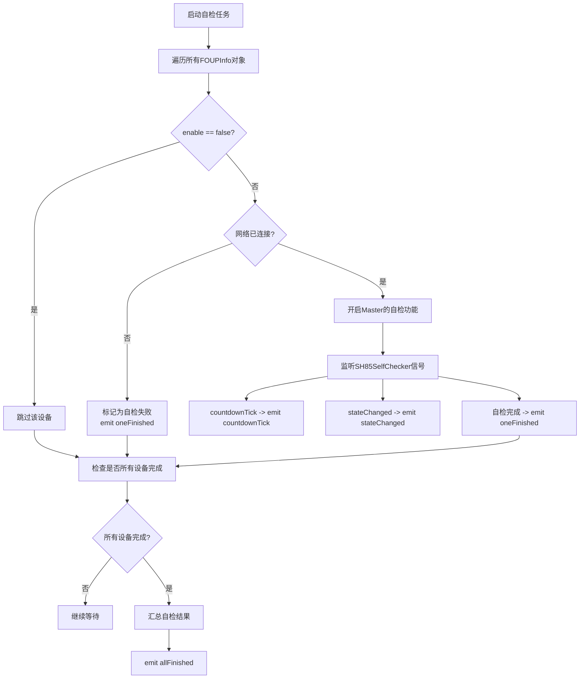
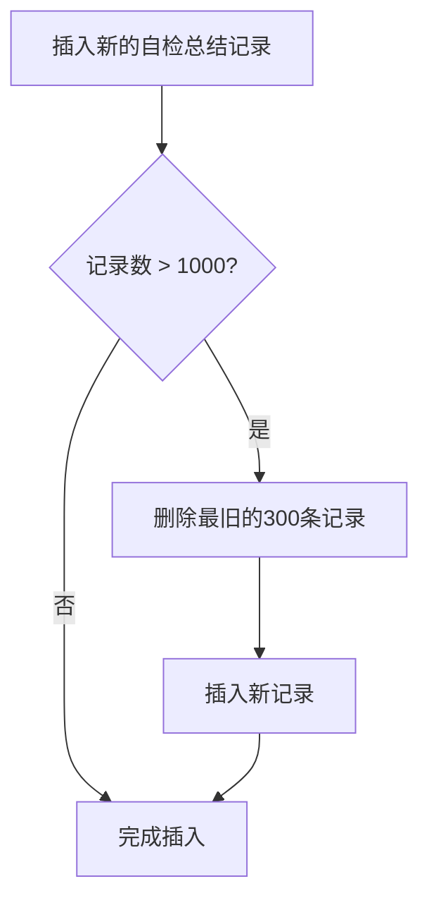

# SH85周期自检实现文档

## 设计思路

SH85周期自检功能是一个定时执行的设备自检系统，核心设计理念如下：

1. **分层架构**：UI层负责参数配置和状态展示，调度层负责任务编排和执行，数据层负责具体自检逻辑
2. **状态驱动**：通过状态机管理自检流程（自检中、等待下次自检中）
3. **批量处理**：支持多设备并发自检，汇总结果统计
4. **容错机制**：网络未连接设备直接标记为失败，不影响其他设备自检
5. **可配置性**：支持动态开关自检功能、调整自检周期

---

## UI界面设计

### 周期SH85自检SettingWidget

#### 组件布局

| 组件 | 类型 | 说明 |
|---|---|---|
| **Item 1** | - | 是否启用周期自检功能 |
| - 启用开关 | ComboBox | 两个选项：true、false |
| **Item 2** | - | 周期自检参数设置 |
| - 时间数值 | SpinBox | 整数类型，设置时间值 |
| - 时间单位 | ComboBox | 选项：s（秒）、min（分钟）、hour（小时） |
| - 设置按钮 | PushButton | 点击后设置自检参数 |
| **Item 3** | - | 自检状态 |
| - 状态显示 | LineEdit | 只读模式，显示周期自检状态 |
| **Item 4** | - | 查看自检报告 |
| - 报告按钮 | PushButton | 点击后打开自检报告模态框 |

#### 自检状态说明

| 状态 | 显示内容 | 说明 |
|---|---|---|
| 自检功能未启用 | "自检功能未启用" | 周期自检功能已关闭 |
| 自检中 | "自检中（执行：Xs）" | 显示自检已花费的时间 |
| 等待下次自检中 | "等待下次自检中（倒计时：Xs）" | 显示距离下次自检的倒计时 |

### 自检报告UI设计

#### 模态框结构

- **Tab Widget**：包含两个标签页

##### Tab 1：Live Log

- **滚动窗口**（Scroll Area）
- **80Port自检表格**（QTableView）
  - 表头：
    - QRCode：设备二维码
    - 执行状态：自检执行状态
    - 倒计时：自检倒计时
    - 是否成功：自检结果（成功/失败）

##### Tab 2：History Log

- **滚动窗口**（Scroll Area）
- **自检报告总结表格**（QTableView）
  - 表头：
    - 自检时间：自检执行时间
    - 成功设备个数：自检成功的设备数量
    - 失败设备个数：自检失败的设备数量
    - 不参加的设备个数：未参与自检的设备数量
    - Description：自检总结描述
  - **数据清理策略**：当表格记录数大于1000行时，删除最旧的300条记录

---

## 调度层设计

### 周期SH85自检调度任务（常驻任务）

#### 公开方法

| 方法 | 说明 |
|---|---|
| `setEnabled(bool enabled)` | 设置是否开启自检功能 |
| `setPeriod(int value, TimeUnit unit)` | 设置自检周期（每隔多久时间执行一次自检功能） |

#### 信号定义

| 信号 | 说明 | 数据来源 |
|---|---|---|
| `countdownTick(int remainingSeconds, const QString& masterId)` | 反馈自检倒计时 | Master对象的SH85SelfChecker子控件的countdownTick信号 |
| `stateChanged(State state, const QString& masterId)` | 反馈执行阶段 | Master对象的SH85SelfChecker子控件的stateChanged信号 |
| `oneFinished(const QString& masterId, bool success, const QString& description)` | 上报单个已完成的设备 | 任务内部处理 |
| `allFinished(const SelfCheckSummary& summary)` | 汇总所有设备的自检结果 | 任务内部处理 |

---

## 核心流程

### 自检任务启动流程



### 自检报告数据清理流程



---

## 关键算法

### 设备过滤算法

```cpp
void SH85SelfCheckTask::startSelfCheck()
{
    QList<FOUPInfo> allDevices = SharedData::getAllFOUPInfo();
    SelfCheckSummary summary;
    
    for (const FOUPInfo& info : allDevices) {
        // 过滤掉未启用的设备
        if (!info.enable) {
            summary.skippedCount++;
            continue;
        }
        
        // 检索网络连接状态
        auto* master = SharedData::getMasterByQRCode(info.qrCode);
        if (!master || !master->isConnected()) {
            // 网络未连接，直接标记为失败
            summary.failedCount++;
            emit oneFinished(info.qrCode, false, "网络未连接");
            continue;
        }
        
        // 开启自检
        master->selfChecker()->start();
        summary.totalCount++;
    }
    
    // 等待所有设备完成...
}
```

### 历史记录清理策略

```cpp
void SelfCheckReportModel::addRecord(const SelfCheckSummaryRecord& record)
{
    m_records.append(record);
    
    // 当记录数超过1000时，删除最旧的300条
    if (m_records.size() > 1000) {
        // 删除前300条（最旧的记录）
        for (int i = 0; i < 300 && !m_records.isEmpty(); ++i) {
            m_records.removeFirst();
        }
    }
    
    // 刷新显示
    refresh();
}
```

---

## 数据结构

### SelfCheckSummary 结构体

```cpp
struct SelfCheckSummary {
    QDateTime checkTime;          // 自检时间
    int successCount;             // 成功设备个数
    int failedCount;              // 失败设备个数
    int skippedCount;             // 不参加的设备个数
    QString description;          // 自检总结描述
};
```

### SelfCheckSummaryRecord 结构体（History Log）

```cpp
struct SelfCheckSummaryRecord {
    QDateTime checkTime;          // 自检时间
    int successCount;             // 成功设备个数
    int failedCount;              // 失败设备个数
    int skippedCount;             // 不参加的设备个数
    QString description;          // 自检总结描述
};
```

### LiveLogRecord 结构体（Live Log）

```cpp
struct LiveLogRecord {
    QString qrCode;               // 设备二维码
    QString status;               // 执行状态
    int countdown;                // 倒计时
    bool success;                 // 是否成功
};
```

### TimeUnit 枚举

```cpp
enum class TimeUnit {
    Second,   // 秒
    Minute,   // 分钟
    Hour      // 小时
};
```

---

## 依赖关系

### 外部依赖

| 依赖项 | 用途 |
|---|---|
| `SchedulerTask` | 基类，提供任务生命周期管理 |
| `SH85SelfChecker` | 设备自检核心逻辑（ModbusTcpMaster的子控件） |
| `FOUPInfo` | 设备信息结构体 |
| `ModbusTcpMaster` | 设备通信主控 |
| `SharedData` | 获取设备信息和Master对象 |

### 上层依赖（注册方）

| 组件 | 角色 |
|---|---|
| `SharedData` | 创建并注册任务到调度器，提供全局访问入口 |
| `SH85SelfCheckSettingWidget` | UI层，配置自检参数和显示状态 |
| `SelfCheckReportDialog` | UI层，显示自检报告 |

### 下层依赖（消费方）

| 组件 | 角色 |
|---|---|
| `SH85SelfChecker` | 执行具体自检逻辑，发出状态信号 |

---

## 实现细节

### 1. 自检周期计算

```cpp
void SH85SelfCheckTask::setPeriod(int value, TimeUnit unit)
{
    qint64 milliseconds = 0;
    switch (unit) {
        case TimeUnit::Second:
            milliseconds = value * 1000;
            break;
        case TimeUnit::Minute:
            milliseconds = value * 60 * 1000;
            break;
        case TimeUnit::Hour:
            milliseconds = value * 60 * 60 * 1000;
            break;
    }
    m_periodMs = milliseconds;
}
```

### 2. 信号转发机制

```cpp
void SH85SelfCheckTask::onMasterSelfCheckStarted(const QString& masterId)
{
    auto* master = SharedData::getMasterByMasterId(masterId);
    if (!master) return;
    
    // 转发 countdownTick 信号
    connect(master->selfChecker(), &SH85SelfChecker::countdownTick,
            this, [this](int remainingSeconds, const QString& mid) {
                emit countdownTick(remainingSeconds, mid);
            });
    
    // 转发 stateChanged 信号
    connect(master->selfChecker(), &SH85SelfChecker::stateChanged,
            this, [this](SH85SelfChecker::State state, const QString& mid) {
                emit stateChanged(state, mid);
            });
}
```

### 3. 结果汇总算法

```cpp
void SH85SelfCheckTask::onAllFinished()
{
    SelfCheckSummary summary;
    summary.checkTime = QDateTime::currentDateTime();
    
    // 统计结果
    for (const auto& result : m_deviceResults) {
        if (result.success) {
            summary.successCount++;
        } else {
            summary.failedCount++;
        }
    }
    summary.skippedCount = m_skippedDeviceCount;
    
    // 生成描述
    summary.description = QString("自检完成：成功%1个，失败%2个，跳过%3个")
                            .arg(summary.successCount)
                            .arg(summary.failedCount)
                            .arg(summary.skippedCount);
    
    emit allFinished(summary);
}
```

---

## 文件位置

| 文件 | 路径 |
|---|---|
| 调度任务头文件 | `OHB80PortMonitor_V_1_0_0/scheduler/tasks/sh85_self_check_task.h` |
| 调度任务实现文件 | `OHB80PortMonitor_V_1_0_0/scheduler/tasks/sh85_self_check_task.cpp` |
| UI设置Widget头文件 | `OHB80PortMonitor_V_1_0_0/ui/customwidget/sh85selfchecksettingwidget.h` |
| UI设置Widget实现文件 | `OHB80PortMonitor_V_1_0_0/ui/customwidget/sh85selfchecksettingwidget.cpp` |
| 自检报告Dialog头文件 | `OHB80PortMonitor_V_1_0_0/ui/dialog/selfcheckreportdialog.h` |
| 自检报告Dialog实现文件 | `OHB80PortMonitor_V_1_0_0/ui/dialog/selfcheckreportdialog.cpp` |
| 实现文档 | `OHB80PortMonitor_V_1_0_0/docs/realize/sh85_periodic_self_check.md` |
