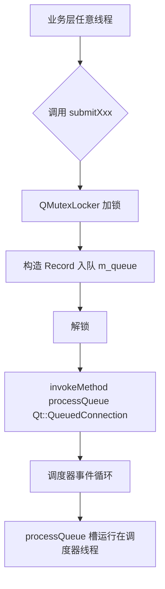
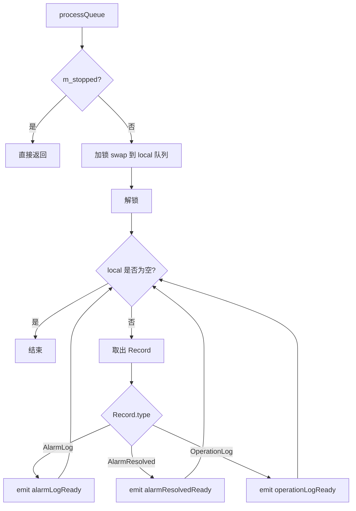
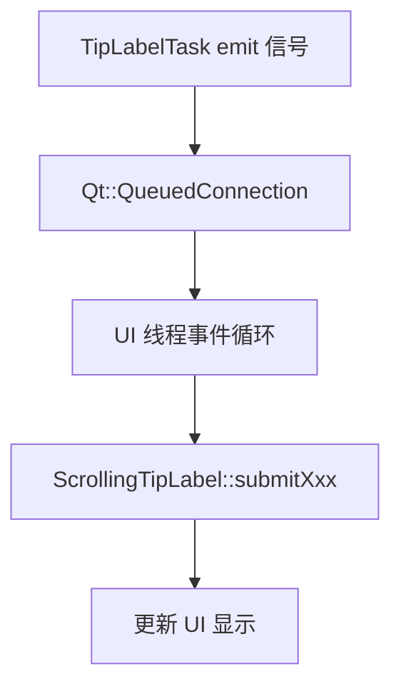

# TipLabelTask 实现文档

## 设计思路

TipLabelTask 是调度层与 UI 层之间的桥接常驻任务，核心设计理念如下：

1. **解耦**：业务层通过 `SharedData::getTipLabelTask()` 提交日志，无需知道 UI 控件的存在
2. **生产者-消费者**：任意线程入队（生产），调度器线程出队（消费）并 emit 信号
3. **线程安全**：`QMutex` 保护队列，`QMetaObject::invokeMethod(Qt::QueuedConnection)` 触发消费
4. **信号路由**：消费后 emit 信号，UI 端通过 `Qt::QueuedConnection` 接收，确保在 UI 线程执行

---

## 核心流程

### 提交日志流程（生产者侧）



### 消费流程（processQueue）



### 信号路由到 UI 流程



---

## 关键算法

### 无锁 swap 技巧

`processQueue` 使用 `swap` 将队列本地化，减少锁持有时间：

```cpp
void TipLabelTask::processQueue()
{
    if (m_stopped) return;

    QQueue<Record> local;           // 1. 局部变量（栈上），初始为空
    {
        QMutexLocker locker(&m_mutex);  // 2. 进入作用域时自动加锁
        local.swap(m_queue);            // 3. 交换两个队列的内容（O(1)）
    }                                   // 4. 离开作用域时自动解锁

    // 5. 无锁处理队列中的所有记录
    while (!local.isEmpty()) {
        const Record rec = local.dequeue();
        // emit 信号...
    }
}
```

#### swap 操作原理

`QQueue::swap` 是一个 O(1) 操作，它只交换两个队列内部的指针：

```
交换前：
local:  [ ] (空，栈上)
m_queue: [A, B, C, D, E] (共享数据)

交换后：
local:  [A, B, C, D, E] (栈上，不再需要锁保护)
m_queue: [ ] (空，可以接受新的入队)
```

#### 不使用 swap 的问题

```cpp
void processQueue() {
    QMutexLocker locker(&m_mutex);  // 持锁整个处理时间
    while (!m_queue.isEmpty()) {
        emit ...  // emit 信号可能很慢，阻塞生产者
    }
}
```
- 问题：生产者在入队时会阻塞，等待消费者处理完所有记录

#### 使用 swap 的优点

- 生产者只在入队时短暂持锁，不会被消费者的处理时间阻塞
- 消费者处理时不持锁，不影响生产者
- 锁持有时间从 O(n) 降到 O(1)

#### 适用场景
- 生产者-消费者模式
- 队列处理时间较长（如 emit 信号、网络请求）
- 需要高并发的场景

#### 核心思想
**用极短的锁持有时间（交换指针）换取长时间的无锁处理**

---

## 数据结构

### Record 结构体

```cpp
struct Record {
    enum Type { AlarmLog, AlarmResolved, OperationLog };
    Type        type;
    QStringList operationLog;   // AlarmLog / OperationLog 使用
    int         alarmRecordId;  // AlarmLog / AlarmResolved 使用
};
```

### 主要成员变量

| 成员变量 | 类型 | 说明 |
|---|---|---|
| `m_queue` | `QQueue<Record>` | 日志记录队列（生产者-消费者共享） |
| `m_mutex` | `QMutex` | 保护 m_queue 的互斥锁 |
| `m_stopped` | `bool` | 任务是否已停止（stop() 后设为 true） |

---

## 依赖关系

### 外部依赖

| 依赖项 | 用途 |
|---|---|
| `SchedulerTask` | 基类，提供任务生命周期管理 |
| `QMutex / QMutexLocker` | 队列线程安全保护 |
| `QQueue<Record>` | 内部日志记录缓冲 |
| `QMetaObject::invokeMethod` | 跨线程触发消费槽 |

### 上层依赖（注册方）

| 组件 | 角色 |
|---|---|
| `SharedData` | 创建并注册任务到调度器，提供全局访问入口 |
| `UIDemo6::connectTipLabelTask()` | 将信号连接到 `scrollingTipLabel` |

### 下层依赖（消费方）

| 组件 | 角色 |
|---|---|
| `ScrollingTipLabel` | 接收信号，更新 UI 显示 |

---

## 实现细节

### 1. 生产者-消费者核心代码

```cpp
void TipLabelTask::submitAlarmLog(const QStringList& operationLog, int alarmRecordId)
{
    {
        QMutexLocker locker(&m_mutex);
        m_queue.enqueue({ Record::AlarmLog, operationLog, alarmRecordId });
    }
    // 通知消费者在调度器线程处理
    QMetaObject::invokeMethod(this, "processQueue", Qt::QueuedConnection);
}
```

### 2. 初始化顺序要求

```
App 启动
    ↓
UIDemo6 构造（含 ui->setupUi）
    ↓
App::initScheduler()
    ├── 提交 TipLabelTask → start() 被调用
    └── ...
    ↓
UIDemo6::connectTipLabelTask()
    └── connect(TipLabelTask::signals → ScrollingTipLabel::slots)
```

**关键：** `connectTipLabelTask()` 必须在 `initScheduler()` 后调用，否则 `SharedData::getTipLabelTask()` 返回 nullptr。

---

## 文件位置

| 文件 | 路径 |
|---|---|
| 头文件 | `OHB80PortMonitor_V_1_0_0/scheduler/tasks/tip_label_task.h` |
| 实现文件 | `OHB80PortMonitor_V_1_0_0/scheduler/tasks/tip_label_task.cpp` |
| API 文档 | `OHB80PortMonitor_V_1_0_0/docs/api/tip_label_task.md` |
| 实现文档 | `OHB80PortMonitor_V_1_0_0/docs/realize/tip_label_task.md` |
