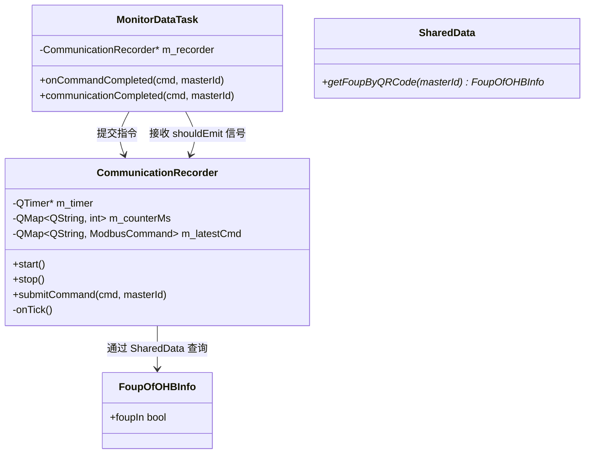
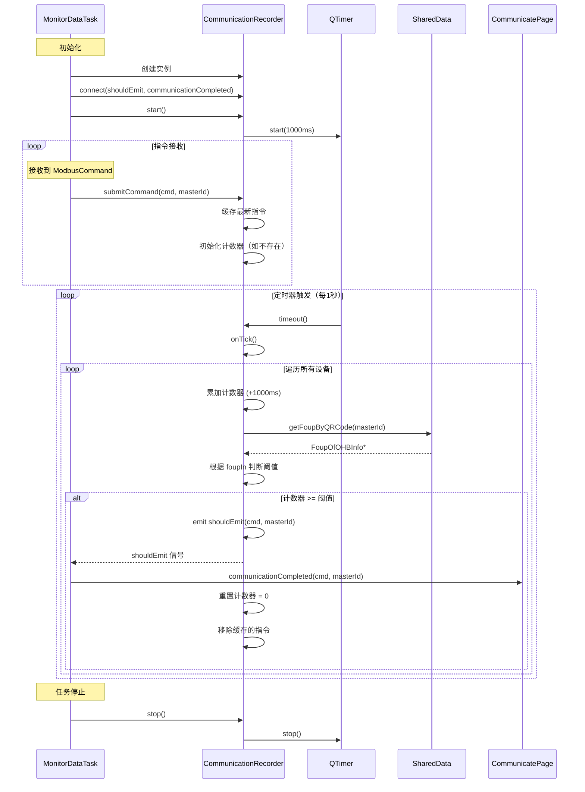
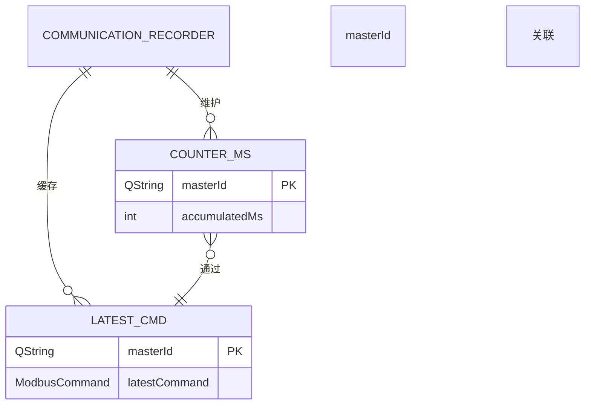
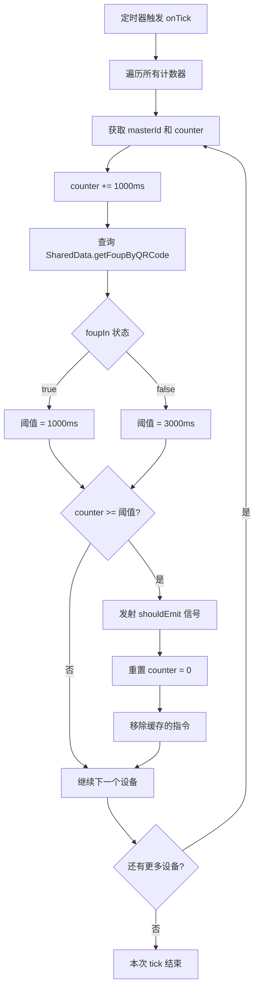

# CommunicationRecorder 实现文档

## 概述

`CommunicationRecorder` 是一个通讯记录采集器（节流器），用于对 Modbus 通讯指令的上报频率进行节流，减轻 UI 日志写入压力。

**核心策略：**
- 设备工作中（`FoupOfOHBInfo::foupIn == true`）：每 1 秒上报一次最新指令
- 设备空闲（`FoupOfOHBInfo::foupIn == false`）：每 3 秒上报一次最新指令

## 实现原理

### 架构设计



### 工作流程



### 数据结构



### 节流逻辑流程图



## 公开方法详解

### `CommunicationRecorder(QObject* parent = nullptr)`

**功能：** 构造函数，初始化采集器实例。

**实现细节：**
- 调用父类 `QObject` 构造函数
- 创建 `QTimer` 实例，设置间隔为 1000ms（`TICK_INTERVAL_MS`）
- 连接定时器 `timeout` 信号到 `onTick` 槽函数

**参数说明：**
- `parent`：父对象，用于 Qt 对象树管理

---

### `~CommunicationRecorder()`

**功能：** 析构函数，清理资源。

**实现细节：**
- 调用 `stop()` 确保定时器停止

---

### `void start()`

**功能：** 启动定时器，开始时间累加和节流判断。

**实现细节：**
- 检查定时器是否已激活
- 若未激活，调用 `QTimer::start()`

**使用场景：**
- 在任务启动时调用（如 `MonitorDataTask::start()`）

---

### `void stop()`

**功能：** 停止定时器，暂停节流判断。

**实现细节：**
- 检查定时器是否激活
- 若激活，调用 `QTimer::stop()`

**使用场景：**
- 在任务停止时调用（如 `MonitorDataTask::stop()`）

---

### `void submitCommand(const ModbusCommand& cmd, const QString& masterId)`

**功能：** 提交一条指令给采集器，由外部调用。

**参数说明：**
- `cmd`：Modbus 指令对象，包含请求帧、响应帧、发送/响应时间等
- `masterId`：设备 qrCode，用于标识设备

**实现细节：**
1. 检查 `masterId` 是否为空，空则直接返回
2. 将指令缓存到 `m_latestCmd[masterId]`（覆盖旧指令）
3. 确保 `m_counterMs[masterId]` 存在，若不存在则初始化为 0

**设计意图：**
- 只缓存最新指令，不直接发射信号
- 时间累加由定时器统一管理，避免每次提交都进行时间判断
- 覆盖旧指令确保 UI 只显示最新通讯状态

**使用场景：**
- 在 `MonitorDataTask::onCommandCompleted()` 中调用
- 每接收到一条 Modbus 指令都调用此方法

---

## 私有方法详解

### `void onTick()`

**功能：** 定时器回调，执行时间累加和节流判断。

**实现细节：**
1. 遍历 `m_counterMs` 中所有设备的计数器
2. 对每个计数器累加 `TICK_INTERVAL_MS`（1000ms）
3. 通过 `SharedData::getFoupByQRCode(masterId)` 查询 Foup 状态
4. 根据 `foupIn` 状态决定阈值：
   - `foupIn == true`：阈值 = `THRESHOLD_FOUP_IN_MS`（1000ms）
   - `foupIn == false`：阈值 = `THRESHOLD_FOUP_OUT_MS`（3000ms）
5. 判断计数器是否达到阈值：
   - 若达到：发射 `shouldEmit(cmd, masterId)` 信号，重置计数器为 0，移除缓存的指令
   - 若未达到：继续下一个设备

**设计意图：**
- 集中管理时间计算，避免分散在多个位置
- 动态根据 Foup 状态调整节流策略
- 发射后移除缓存，避免无新指令时重复上报

**注意事项：**
- 此方法由定时器每 1 秒自动调用
- 需要确保 `SharedData::getFoupByQRCode()` 返回有效指针

---

## 使用用例

### 用例 1：在 MonitorDataTask 中集成

```cpp
// monitor_data_task.h
class MonitorDataTask : public SchedulerTask
{
    Q_OBJECT
private:
    CommunicationRecorder* m_recorder = nullptr;
};

// monitor_data_task.cpp
#include "communicationrecorder.h"

MonitorDataTask::MonitorDataTask(QObject* parent)
    : SchedulerTask(parent)
    , m_recorder(new CommunicationRecorder(this))
{
    // 连接采集器的 shouldEmit 信号到任务的 communicationCompleted 信号
    connect(m_recorder, &CommunicationRecorder::shouldEmit,
            this, &MonitorDataTask::communicationCompleted);
}

void MonitorDataTask::start()
{
    // 启动采集器
    if (m_recorder) {
        m_recorder->start();
    }
    // ... 其他启动逻辑
}

void MonitorDataTask::stop()
{
    // 停止采集器
    if (m_recorder) {
        m_recorder->stop();
    }
    // ... 其他停止逻辑
}

void MonitorDataTask::onCommandCompleted(ModbusCommand cmd, const QString& masterId)
{
    if (m_stopped) return;

    // 提交给采集器进行节流
    if (m_recorder) {
        m_recorder->submitCommand(cmd, masterId);
    }

    // ... 其他业务逻辑
}
```

### 用例 2：在 UI 层接收信号

```cpp
// communicatepage.cpp
void CommunicatePage::initCommLoggerWidget()
{
    // 获取 MonitorDataTask 实例
    MonitorDataTask* monitorTask = SharedData::getMonitorDataTask();
    if (monitorTask) {
        connect(monitorTask, &MonitorDataTask::communicationCompleted,
                this, &CommunicatePage::onCommunicationCompleted);
    }
}

void CommunicatePage::onCommunicationCompleted(ModbusCommand cmd, QString masterId)
{
    // 计算响应时间
    qint64 responseTimeMs = cmd.responseMs - cmd.sentMs;

    // 格式化帧数据为十六进制字符串
    QString sendFrame = cmd.sendFrame.toHex(' ').toUpper();
    QString receiveFrame = cmd.receiveFrame.toHex(' ').toUpper();

    // 写入日志
    ui->commLoggerWidget->writeLog({
        QStringLiteral("info"),
        masterId,
        cmd.id,
        QString::number(responseTimeMs),
        sendFrame,
        receiveFrame
    });
}
```

### 用例 3：独立使用（不依赖 MonitorDataTask）

```cpp
// 自定义任务中使用
class CustomTask : public QObject
{
    Q_OBJECT
private:
    CommunicationRecorder* m_recorder;

public:
    CustomTask(QObject* parent = nullptr) : QObject(parent)
    {
        m_recorder = new CommunicationRecorder(this);
        connect(m_recorder, &CommunicationRecorder::shouldEmit,
                this, &CustomTask::handleThrottledCommand);
        m_recorder->start();
    }

    void onCommandReceived(ModbusCommand cmd, QString masterId)
    {
        m_recorder->submitCommand(cmd, masterId);
    }

signals:
    void handleThrottledCommand(ModbusCommand cmd, QString masterId);
};
```

## 常量定义

```cpp
// 定时器间隔（毫秒）
static constexpr int TICK_INTERVAL_MS      = 1000;

// Foup 存在时阈值（设备工作中，1秒上报一次）
static constexpr int THRESHOLD_FOUP_IN_MS  = 1000;

// Foup 空闲时阈值（设备空闲，3秒上报一次）
static constexpr int THRESHOLD_FOUP_OUT_MS = 3000;
```

## 性能考虑

1. **内存占用**：
   - `m_counterMs` 和 `m_latestCmd` 按设备数量线性增长
   - 对于 20 个设备，内存占用可忽略不计

2. **CPU 占用**：
   - 定时器每 1 秒触发一次，遍历所有设备
   - 每次操作为 O(n)，n 为设备数量
   - 对于 20 个设备，CPU 占用极低

3. **线程安全**：
   - 当前实现假设在单线程中使用
   - 如需跨线程使用，需添加互斥锁保护 `m_counterMs` 和 `m_latestCmd`

## 扩展建议

1. **可配置阈值**：
   - 将阈值改为从配置文件读取，支持动态调整

2. **统计功能**：
   - 添加上报次数统计，用于监控节流效果

3. **异常处理**：
   - 处理 `SharedData::getFoupByQRCode()` 返回 nullptr 的情况
   - 添加默认阈值策略

4. **线程安全**：
   - 使用 `QMutex` 保护共享数据，支持跨线程使用
