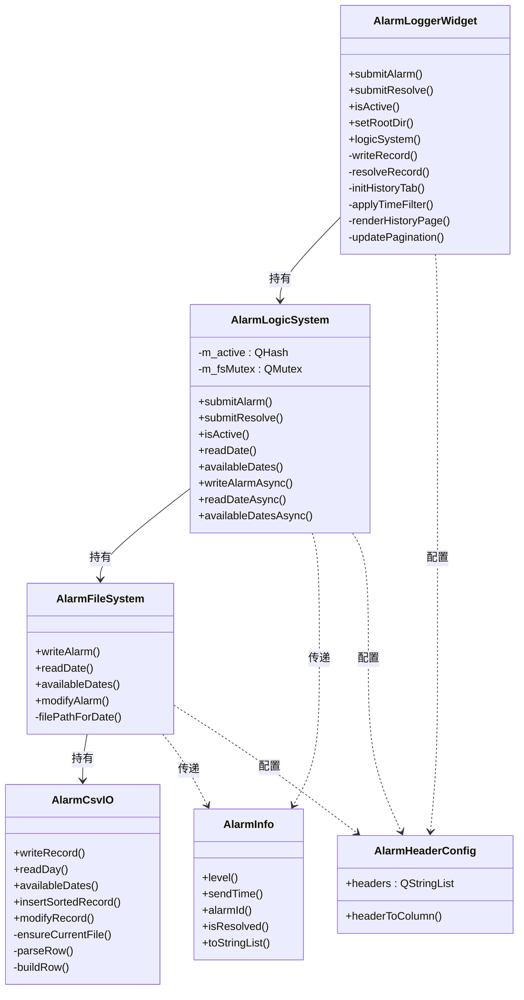
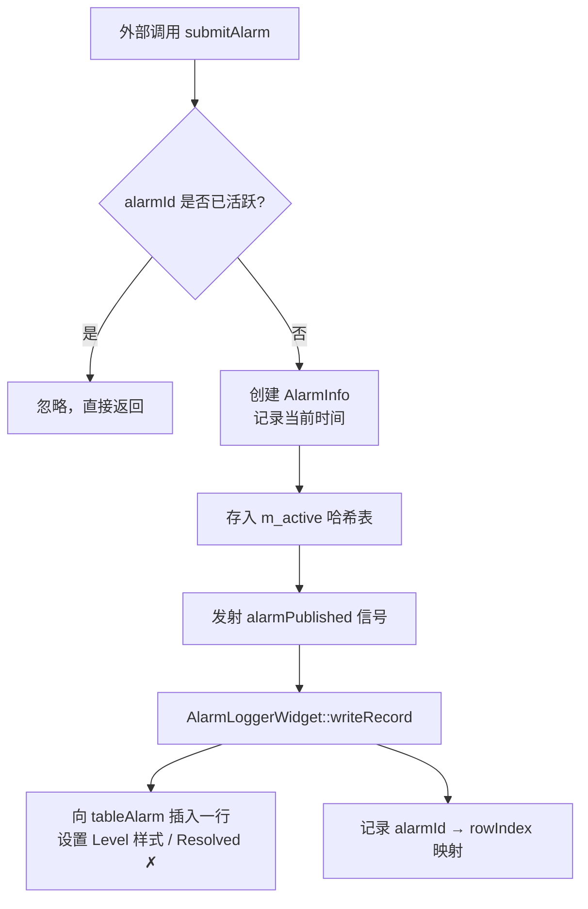
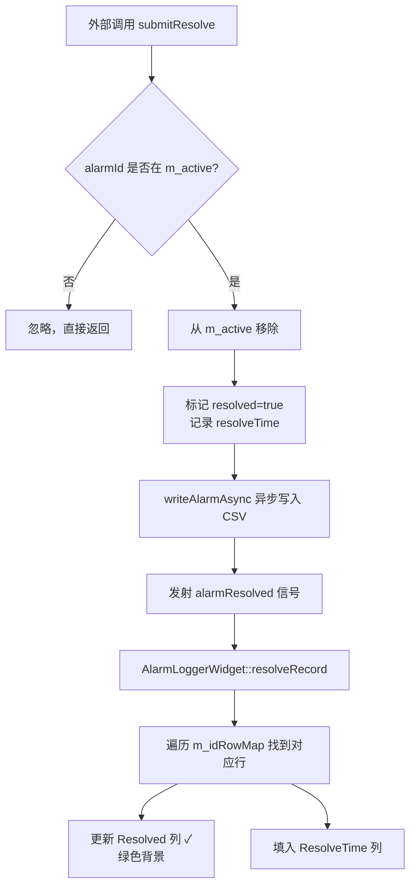
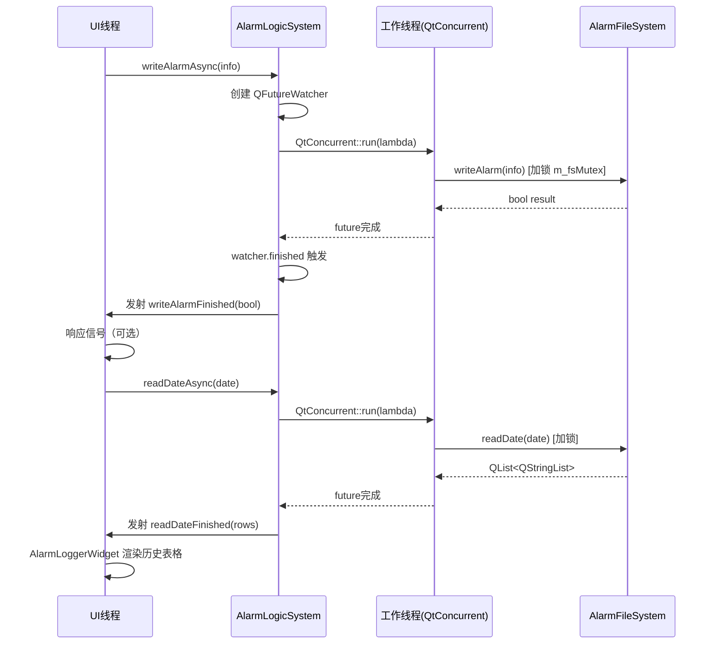
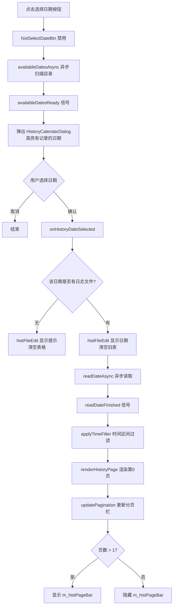
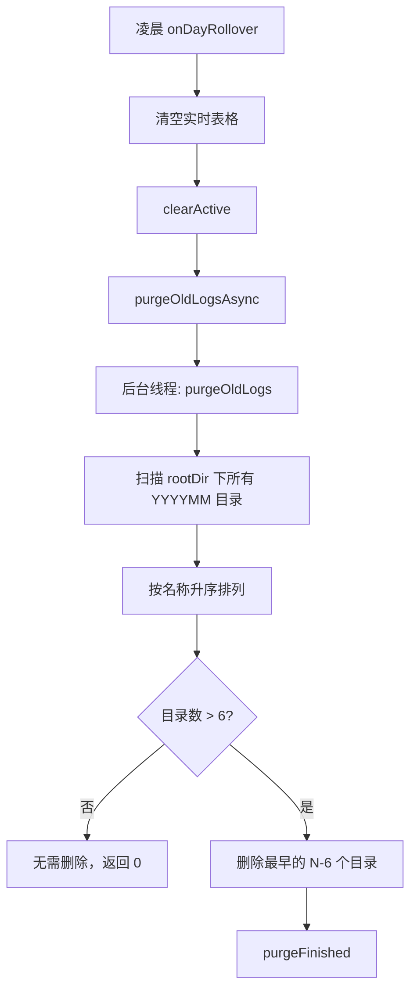
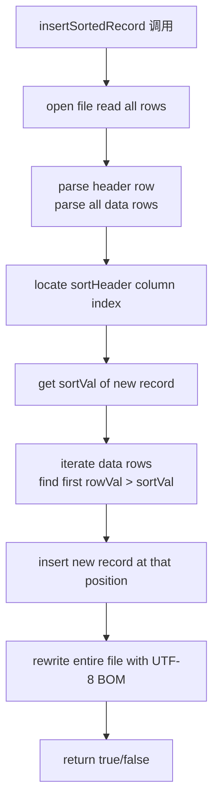

# AlarmLoggerWidget 开发文档

> 适用版本：V1.0.0  
> 依赖：Qt 5.x / Qt 6.x，需在 `.pro` 中开启 `QT += widgets concurrent`

---

## 目录

1. [模块概述](#1-模块概述)
2. [架构总览](#2-架构总览)
3. [类职责与依赖关系](#3-类职责与依赖关系)
4. [核心流程图](#4-核心流程图)
   - 4.1 [警报提交流程](#41-警报提交流程)
   - 4.2 [警报解决流程](#42-警报解决流程)
   - 4.3 [异步 I/O 流程](#43-异步-io-流程)
   - 4.4 [历史记录查询流程](#44-历史记录查询流程)
   - 4.5 [CSV 写入排序流程](#45-csv-写入排序流程)
5. [文件目录结构](#5-文件目录结构)
6. [数据模型](#6-数据模型)
7. [公开接口详解](#7-公开接口详解)
   - 7.1 [AlarmLoggerWidget](#71-alarmloggerwidget)
   - 7.2 [AlarmLogicSystem](#72-alarmlogicsystem)
   - 7.3 [AlarmFileSystem](#73-alarmfilesystem)
   - 7.4 [AlarmCsvIO](#74-alarmcsvio)
   - 7.5 [AlarmInfo](#75-alarminfo)
   - 7.6 [AlarmId 工具函数](#76-alarmid-工具函数)
   - 7.7 [AlarmHeaderConfig](#77-alarmheaderconfig)
8. [私有方法详解](#8-私有方法详解)
9. [集成使用流程](#9-集成使用流程)
10. [注意事项与限制](#10-注意事项与限制)

---

## 1. 模块概述

`AlarmLoggerWidget` 是一个自包含的 Qt 控件模块，提供：

- **实时记录**：接收警报提交、去重、在表格中实时展示，凌晨自动跨日重置
- **历史查询**：按日期浏览历史 CSV 日志，支持时间区间过滤、关键字搜索、分页翻页
- **持久化**：将警报记录以 CSV 格式按日期写入本地文件，字段按 `SendTime` 升序插入
- **异步 I/O**：所有磁盘读写通过 `QtConcurrent` 在后台线程执行，UI 全程响应

通过 `include($$PWD/alarmloggerwidget/alarmloggerwidget.pri)` 一行即可集成到任意 Qt 项目。

---

## 2. 架构总览

模块采用 **分层架构**，从上到下依次为：

| 层级 | 类 | 职责 |
|---|---|---|
| UI 层 | `AlarmLoggerWidget` | 控件入口，管理两个 Tab（实时/历史） |
| 逻辑层 | `AlarmLogicSystem` | 去重、状态管理、异步调度、信号广播 |
| 文件层 | `AlarmFileSystem` | 按日期定位文件，封装读写语义 |
| I/O 层 | `AlarmCsvIO` | 原始 CSV 读写、解析、路径管理 |
| 数据层 | `AlarmInfo` / `AlarmId` | 警报数据载体与 ID 编解码 |

---

## 3. 类职责与依赖关系



---

## 4. 核心流程图

### 4.1 警报提交流程



### 4.2 警报解决流程



### 4.3 异步 I/O 流程



### 4.4 历史记录查询流程



### 4.5 CSV 写入排序流程

### 4.6 日志清理流程





---

## 5. 文件目录结构

```
alarmloggerwidget/
├── alarmloggerwidget.pri       # qmake 集成入口
├── alarmloggerwidget.h/.cpp    # 主控件：UI + 业务调度
├── alarmloggerwidget.ui        # Qt Designer UI 定义
├── alarmlogicsystem.h/.cpp     # 警报逻辑层（去重、状态、异步）
├── alarmfilesystem.h/.cpp      # 文件持久化层（日期定位）
├── alarmcsvio.h/.cpp           # CSV 底层读写
├── alarminfo.h                 # 警报数据结构
├── alarmid.h                   # ID 编码规则 + 枚举
├── alarmheaderconfig.h         # 表头配置结构
└── historycalendardialog/      # 日期选择对话框子模块
    ├── historycalendardialog.pri
    ├── historycalendardialog.h/.cpp
    └── historycalendardialog.ui
```

**CSV 文件存储结构：**

```
<rootDir>/
└── YYYYMM/                  ← 年月目录，例如 202604
    └── DD_HHmmss.csv        ← 每日文件，例如 09_083000.csv
```

每个 CSV 文件首行为表头，后续行按 `SendTime` 升序排列。

---

## 6. 数据模型

### 警报 ID 编码（9位十进制整数）

```
[Level(1位)] [PortId(5位)] [AlarmCode(3位)]
     1           12001           000
└─────────────────────────────────────────┘
         → 112001000
```

| 字段 | 位数 | 说明 |
|---|---|---|
| Level | 第1位 | 1=Warn，2=Error |
| PortId | 第2-6位 | 设备端口号（1~99999） |
| AlarmCode | 第7-9位 | 0xx=全局，1xx=硬件，2xx=软件 |

### CSV 列定义

| 列名 | 类型 | 说明 |
|---|---|---|
| Level | String | `warn` / `Error` |
| SendTime | DateTime | `yyyy-MM-dd HH:mm:ss`，文件内按此升序 |
| QRCode | String | 设备标识码 |
| AlarmId | String | 9位零填充 ID |
| Resolved | String | `Yes` / `No` |
| ResolveTime | String | 解决时刻，未解决为空 |
| Message | String | 警报描述 |

---

## 7. 公开接口详解

### 7.1 AlarmLoggerWidget

主控件，继承自 `QWidget`，是模块的唯一对外入口。

---

#### 构造函数

```cpp
AlarmLoggerWidget(QWidget *parent = nullptr);
AlarmLoggerWidget(const AlarmHeaderConfig &config, QWidget *parent = nullptr);
```

- 无参版本使用默认表头（Level / SendTime / QRCode / AlarmId / Resolved / ResolveTime / Message）
- 带 `config` 版本支持自定义表头顺序和名称

---

#### `setRootDir(const QString &dir)`

设置 CSV 日志文件的根目录。应在首次提交警报前调用。

```cpp
widget->setRootDir("log");  // 相对路径或绝对路径均可
```

---

#### `submitAlarm(AlarmLevel level, const QString &qrCode, qint64 alarmId, const QString &message)`

提交一条新警报。

- 若 `alarmId` 已存在于活跃列表，则忽略（自动去重）
- 通过后在 UI 表格末尾插入一行，并发射 `alarmPublished` 信号

```cpp
qint64 id = makeAlarmId(AlarmLevel::Warn, 12001, AlarmCode::GlobalOverHumidity);
widget->submitAlarm(AlarmLevel::Warn, "12001", id, "超湿报警触发");
```

---

#### `submitResolve(qint64 alarmId)`

提交一条警报解决。

- 若 `alarmId` 不在活跃列表，则忽略
- 通过后将对应行 `Resolved` 列改为 `✓`（绿色），填入 `ResolveTime`
- 异步将完整记录写入 CSV
- 发射 `alarmResolved` 信号

---

#### `isActive(qint64 alarmId) → bool`

查询某警报是否仍处于活跃（未解决）状态。

---

#### `logicSystem() → AlarmLogicSystem *`

返回内部逻辑处理器指针，供外部连接异步结果信号（`writeAlarmFinished`、`readDateFinished` 等）。

---

#### 信号

| 信号 | 触发时机 |
|---|---|
| `alarmPublished(AlarmInfo)` | 新警报通过去重验证，写入表格后 |
| `alarmResolved(AlarmInfo)` | 警报解决成功，UI 更新后 |

---

### 7.2 AlarmLogicSystem

警报状态管理与异步调度核心。

---

#### `submitAlarm / submitResolve`

与 `AlarmLoggerWidget` 同名方法语义相同，是 Widget 的直接委托目标。

---

#### `isActive(qint64) → bool`

查询活跃状态，线程安全（在主线程调用）。

---

#### `readDate(const QDate &date) → QList<QStringList>`

**同步**读取指定日期全部 CSV 记录（含表头行）。适合小数据量场景。

---

#### `availableDates() → QSet<QDate>`

**同步**扫描目录结构，返回所有有日志文件的日期集合。仅扫描目录名，速度快。

---

#### `writeAlarmAsync(const AlarmInfo &info)`

**异步**将警报写入 CSV。完成后发射 `writeAlarmFinished(bool success)`。

---

#### `readDateAsync(const QDate &date)`

**异步**读取指定日期的 CSV 记录。完成后发射 `readDateFinished(QList<QStringList>)`。

---

#### `availableDatesAsync()`

**异步**扫描可用日期。完成后发射 `availableDatesReady(QSet<QDate>)`。

---

#### `purgeOldLogsAsync(int maxMonths = 6)`

**异步**清理过期月份目录，保留最近 `maxMonths` 个月（默认 6 个月）。完成后发射 `purgeFinished(int deletedCount)`。

由 `AlarmLoggerWidget::onDayRollover()` 在每日凌晨自动调用，无需手动触发。

---

#### 信号（异步结果）

| 信号 | 数据 | 说明 |
|---|---|---|
| `alarmPublished(AlarmInfo)` | 完整警报信息 | 新警报广播 |
| `alarmResolved(AlarmInfo)` | 完整警报信息 | 解决广播 |
| `writeAlarmFinished(bool)` | 写入是否成功 | 异步写入完成 |
| `readDateFinished(rows)` | 含表头的所有行 | 异步读取完成 |
| `availableDatesReady(dates)` | 日期集合 | 异步扫描完成 |
| `purgeFinished(int)` | 删除的目录数 | 异步清理完成 |

---

### 7.3 AlarmFileSystem

文件持久化层，负责日期与文件路径的映射。

---

#### `writeAlarm(const AlarmInfo &info) → bool`

将警报写入当日 CSV 文件（按 `SendTime` 升序插入）。若目录或文件不存在则自动创建。

---

#### `readDate(const QDate &date) → QList<QStringList>`

读取指定日期的完整 CSV（第一行为表头）。

---

#### `availableDates() → QSet<QDate>`

扫描 `rootDir` 下所有 `YYYYMM/DD_*.csv`，返回有日志的日期集合。

---

#### `modifyAlarm(qint64 alarmId, const QString &sendTime, const QHash<QString,QString> &changes) → bool`

通过 `sendTime` 定位日志文件，再通过 `AlarmId` 定位行，批量修改指定字段。

```cpp
fs.modifyAlarm(id, "2026-04-09 14:30:00",
    {{"Resolved", "Yes"}, {"ResolveTime", "2026-04-09 15:00:00"}});
```

---

#### `purgeOldLogs(int maxMonths = 6) → int`

扫描 `rootDir` 下所有格式为 `YYYYMM` 的月份目录，按时间升序删除超出保留期的最早目录，直到目录数不超过 `maxMonths`。

- 返回实际删除的月份目录数
- 删除使用 `QDir::removeRecursively()`（递归删除目录及其所有文件）
- 仅识别格式严格为 `YYYYMM`（6位数字且能被 `QDate` 解析）的目录，不误删其他目录

---

### 7.4 AlarmCsvIO

原始 CSV 读写引擎。

---

#### `setRootDir / setHeaders`

配置根目录和表头。表头在创建新文件时写入第一行。

---

#### `writeRecord(const QStringList &values) → bool`

追加写入一条记录（自动跨日新建文件）。

---

#### `insertSortedRecord(const QString &filePath, const QString &sortHeader, const QStringList &values) → bool`

按 `sortHeader` 列升序，将 `values` 插入到第一条大于它的记录之前。整个文件会被重写。适用于保持 `SendTime` 时序一致性。

---

#### `readDay(const QDate &date) → QList<QStringList>`

读取指定日期当天所有 CSV 文件（合并），返回含表头的所有行。

---

#### `modifyRecord(filePath, keyHeader, keyValue, changes) → bool`

在指定文件中找到 `keyHeader == keyValue` 的所有行并批量修改字段。

---

#### `availableDates() → QSet<QDate>`

扫描目录返回有日志的日期集合。

---

#### `currentFilePath() → QString`

返回当前正在写入的文件路径（首次写入前为空）。

---

### 7.5 AlarmInfo

警报数据载体（值类型，可复制）。

| 方法 | 说明 |
|---|---|
| `level()` | 返回 `AlarmLevel`（Warn / Error） |
| `sendTime()` | 返回创建时的时间字符串 |
| `qrCode()` | 设备 QR 码 |
| `alarmId()` | 9位警报 ID |
| `isResolved()` | 是否已解决 |
| `resolveTime()` | 解决时间字符串 |
| `message()` | 描述文本 |
| `setResolved(bool)` | 标记解决状态 |
| `setResolveTime(QString)` | 设置解决时间 |
| `toStringList()` | 转为 CSV 行（列顺序与默认表头一致） |

---

### 7.6 AlarmId 工具函数

全部为 `inline` 全局函数，定义在 `alarmid.h`。

| 函数 | 说明 |
|---|---|
| `makeAlarmId(level, portId, code)` | 构造 9 位 ID |
| `alarmIdLevel(id)` | 从 ID 解析级别 |
| `alarmIdPortId(id)` | 从 ID 解析端口号 |
| `alarmIdCode(id)` | 从 ID 解析 AlarmCode |
| `alarmIdCategory(id)` | 从 ID 解析类别（0/1/2） |
| `alarmIdSubType(id)` | 从 ID 解析子类型编号 |
| `alarmIdToString(id)` | 格式化为零填充 9 位字符串 |
| `alarmLevelToString(level)` | 级别转字符串（`"warn"` / `"Error"`） |
| `alarmCodeToDescription(code)` | 返回中文描述 |

---

### 7.7 AlarmHeaderConfig

```cpp
struct AlarmHeaderConfig {
    QStringList headers;            // 列名列表（决定表格列顺序）
    int headerToColumn(const QString &) const;  // 列名 → 列索引
};
```

默认表头顺序：`Level → SendTime → QRCode → AlarmId → Resolved → ResolveTime → Message`

自定义示例：

```cpp
AlarmHeaderConfig cfg;
cfg.headers = {"Level", "SendTime", "AlarmId", "Message"};
auto *widget = new AlarmLoggerWidget(cfg, this);
```

---

## 8. 私有方法详解

### AlarmLoggerWidget

| 方法 | 说明 |
|---|---|
| `initTable()` | 初始化实时表格列数、表头、列宽策略、选择模式 |
| `setResolvedCell(row, bool)` | 将指定行的 Resolved 列设为 ✓/✗，附带绿/红背景 |
| `writeRecord(AlarmInfo)` | 由 `alarmPublished` 信号触发，向表格末尾插行、记录 `m_idRowMap` 映射 |
| `resolveRecord(alarmId)` | 由 `alarmResolved` 信号触发，更新表格中对应行的解决状态 |
| `scheduleMidnightReset()` | 计算到次日 00:00:00 的毫秒数并启动单次 `QTimer` |
| `onDayRollover()` | 定时器触发后清空表格、调用 `clearActive()`、调用 `purgeOldLogsAsync()` 清理过期日志，再调用 `scheduleMidnightReset()` 续期 |
| `initHistoryTab()` | 绑定历史 Tab 所有信号槽、连接异步结果信号、初始化历史表格列、将 `histPageBarLayout` 包装进 `m_histPageBar` 并初始隐藏 |
| `onSelectDateClicked()` | 禁用按钮后调用 `availableDatesAsync()` |
| `onHistoryDateSelected(date)` | 定位文件路径、更新 `histFileEdit`、调用 `readDateAsync()` |
| `applyTimeFilter()` | 按勾选的时间区间（时/分/秒）从 `m_histAllRecords` 过滤出 `m_histFiltered`，重置分页和搜索状态 |
| `renderHistoryPage(page)` | 清空表格后渲染第 `page` 页数据，对 Level / Resolved 列应用样式，调用 `updatePagination()` |
| `updatePagination()` | 计算总页数，控制 `m_histPageBar` 显隐，动态生成页码按钮（含省略号跳转） |
| `onPrevPage / onNextPage / goToPage` | 翻页，边界检查后调用 `renderHistoryPage()` |
| `onSearchClicked()` | 先调 `applyTimeFilter()` 刷新数据，再遍历 `m_histFiltered` 收集关键字匹配索引，跳到第一个匹配 |
| `onPrevMatch / onNextMatch` | 循环切换 `m_histMatchIndices` 中的索引，调用 `jumpToMatch()` |
| `jumpToMatch(matchIdx)` | 必要时翻页到匹配行所在页，高亮该行所有单元格（浅蓝色背景），更新匹配计数标签 |
| `collectAvailableDates()` | 同步调用 `m_logic->availableDates()`（保留备用） |
| `headerToColumn(header)` | 委托给 `m_headerConfig.headerToColumn()`，返回列索引 |

---

### AlarmLogicSystem（私有成员）

| 成员 | 类型 | 说明 |
|---|---|---|
| `m_fs` | `AlarmFileSystem` | 文件持久化实例 |
| `m_active` | `QHash<qint64, AlarmInfo>` | 活跃警报表（alarmId → AlarmInfo） |
| `m_fsMutex` | `QMutex` | 保护 `m_fs` 的并发访问（异步线程与主线程互斥） |

---

### AlarmCsvIO（私有方法）

| 方法 | 说明 |
|---|---|
| `ensureCurrentFile()` | 检查当前文件是否跨日，是则新建；首次调用时创建目录和文件并写入表头 |
| `monthDirPath(date)` | 返回 `<rootDir>/YYYYMM/` 的绝对路径 |
| `escapeField(field)` | RFC 4180 转义：含逗号、引号、换行的字段加双引号包裹，内部引号双写 |
| `buildRow(fields)` | 将字段列表组合为一行 CSV 文本 |
| `parseRow(line)` | 解析一行 CSV 文本为字段列表，支持带引号字段 |

---

## 9. 集成使用流程

### Step 1：在 .pro 中引入模块

```qmake
QT += widgets concurrent

include($$PWD/alarmloggerwidget/alarmloggerwidget.pri)
INCLUDEPATH += $$PWD/alarmloggerwidget
```

### Step 2：自定义表头（可选）

```cpp
AlarmHeaderConfig cfg;
cfg.headers = {"Level", "SendTime", "QRCode", "AlarmId",
               "Resolved", "ResolveTime", "Message"};
```

### Step 3：创建控件并配置

```cpp
auto *widget = new AlarmLoggerWidget(cfg, this);
widget->setRootDir("log");  // 日志根目录
layout->addWidget(widget);
```

### Step 4：连接信号（可选）

```cpp
// 监听新警报
connect(widget, &AlarmLoggerWidget::alarmPublished,
        this, [](const AlarmInfo &info) {
            qDebug() << "新警报：" << info.message();
        });

// 监听解决
connect(widget, &AlarmLoggerWidget::alarmResolved,
        this, [](const AlarmInfo &info) {
            qDebug() << "已解决：" << info.message();
        });

// 监听异步写入结果
connect(widget->logicSystem(), &AlarmLogicSystem::writeAlarmFinished,
        this, [](bool ok) {
            if (!ok) qWarning() << "CSV 写入失败";
        });
```

### Step 5：提交与解决警报

```cpp
// 构造警报 ID
qint64 id = makeAlarmId(AlarmLevel::Error, 12001,
                        AlarmCode::HardwareSensorFailure);

// 提交警报（自动去重）
widget->submitAlarm(AlarmLevel::Error, "QR-12001", id, "传感器断线");

// 若干时间后解决
widget->submitResolve(id);
```

### Step 6：查询历史（UI 操作）

1. 切换到"历史记录" Tab
2. 点击"选择日期"，在日历中选择有记录的日期（蓝色高亮）
3. 勾选"时间区间"可按时/分/秒过滤
4. 输入关键字后点击"搜索"，上一个/下一个导航匹配项
5. 若记录超过 50 条，底部显示分页栏

---

## 10. 注意事项与限制

- **线程安全**：`m_fsMutex` 仅保护 `AlarmFileSystem` 的并发访问；`m_active` 哈希表和 UI 操作均在主线程，无需额外同步
- **AlarmId 唯一性**：相同 `alarmId` 在活跃期间会被去重忽略；若需要同一设备同一类型同时有多条警报，需在 `PortId` 或 `AlarmCode` 上加以区分
- **CSV 重写开销**：`insertSortedRecord` 每次写入都会重写整个文件，对于单日警报量极大（>10,000 条）的场景，建议评估性能
- **日志保留策略**：`purgeOldLogs` 以月份目录为最小粒度，精度为整月；若需要精确到天，需自行扩展逻辑
- **清理时机**：清理仅在每日凌晨跨日时触发，不在程序启动时自动运行；若需启动时立即检查，可在初始化后手动调用 `m_logic->purgeOldLogsAsync()`
- **跨日重置**：凌晨 0 点自动清空实时表格和活跃列表；历史数据不受影响，仍可在历史 Tab 查询
- **表头顺序**：`AlarmInfo::toStringList()` 的列顺序固定为默认表头顺序；若使用自定义表头且顺序不同，需同步修改 `toStringList()` 实现
- **UTF-8 BOM**：CSV 文件以 UTF-8 BOM 编码写入，兼容 Excel 直接打开中文内容
